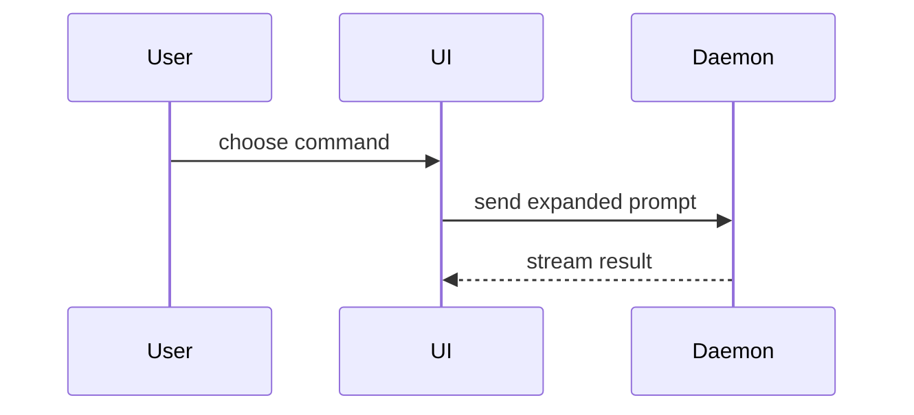

Use this template for writing the PR body, retaining any additional repository
template sections:

```markdown
## Summary

<diagram, diff-sketch, or tree>

## Evidence

- **Before:** <screenshot/output/failing test run>
  **After:** <screenshot/output/passing test run>

## Merge Danger

**Door:** <one-way or two-way>

<optional: description>

**Blast Radius:** <one-word description>

<optional: potential ramifications of merge>
```

## Sections

Skip all preambles and keep prose brief. Use the user's domain language from `GLOSSARY.md`.

### Summary

Pick the smallest view that makes the key point clear.

- Show logic or an algorithm as pseudocode:

```text
on(save)
  if content is unchanged
    return cached result
  write new content
  return fresh result
```

- Show runtime control flow as a call tree:

```text
submitForm
  createSession
    persistPrompt
    launchAgent
  navigateToSession
```

- Show UI structure as a component tree, including state and module boundaries that matter:

```text
<SessionPage> (apps/example/src/routes/session.tsx)
  useSessionEvents()
  <SessionToolbar>
    <RunSkillButton> (packages/ui)
```

- Show file responsibility or a broad refactor as a shallow file tree:

```text
src/
├── commands/       # parses user actions
├── sessions/       # owns session state
└── transport/      # sends API requests
```

- Show component interaction, control flow, or data flow with Mermaid:



- Use `diff` when the point is what changes and the surrounding shape already exists. Match the diff shape to the topic.

For a component change:

```diff
 <SessionPage>
   useSessionEvents()
   <SessionToolbar>
+    <RunSkillButton />
   <SessionTimeline>
+    <SkillResultCard />
```

For a file-layout change:

```diff
 src/
 ├── commands/
+│   └── show-me.ts       # expands the slash command
 ├── sessions/
-└── transport.ts
+└── transport/
+    ├── client.ts
+    └── stream.ts
```

For a call-tree or call-stack change:

```diff
 submitForm
   createSession
     persistPrompt
+    expandSkillMention
     launchAgent
-  navigateToSession
+  navigateToSession
+    subscribeToEvents
```

For a state or control-flow change:

```diff
 on(save)
-  write content
+  if content is unchanged
+    return cached result
+  write new content
+  invalidate cache
```

- Show the whole block when most of it is new, when omitted context would hide ownership or order, or when the user needs a copyable target shape:

```ts
function expandSkill(command: string): string {
  const skillName = command.slice(1);
  return `use the ${skillName} skill`;
}
```

#### Guidance

Place each visual next to the short text it supports. Keep only the calls, files, props, states, and boundaries needed to answer the user's current question or the options to resolve the current discussion point.

You may use one of these, you may use several, it is unlikely you will use all of them. Use your judgement and don't overwhelm the user.

### Evidence

Concrete evidence that the change works. Show a before and after.

Screenshots are S-tier - when the environment is set up for it and the change is visual.

Execution-based evidence is A-tier. Test results, console output. Show the exact test that now fails and passes, using pseudocode.

### Merge Danger

Describe whether it's a one-way or two-way door. You can walk back through two-way doors, but not one-way doors. A PR that is cheap to roll back is lower risk. Changes that involve destructive actions or hard-to-reverse decisions are one-way doors.

The blast radius is the potential impact or scope of the changes introduced by this PR. Consider all possibilities. Examples are layout shift, breakages for consumers, mobile responsiveness, etc.

## Publication

Use these steps when publication is authorized by the user or the issue
implementation workflow in `AGENTS.md`. A request for a PR body alone ends with
the draft body.

1. Resolve the requested base branch, or the repository's main branch with
   `gh repo view --json defaultBranchRef --jq .defaultBranchRef.name`. Preserve
   the current branch. Verify the committed tree matches the reviewed and
   validated snapshot before pushing.
2. Push the branch and verify local/remote SHA parity. Find an existing open PR
   for that head/base before creating one. Update it when present; otherwise
   create the PR with an explicit `--base` and `--head`. Use `--body-file` as
   documented in `docs/agents/issue-tracker.md`.
3. Preserve accurate issue references when writing or replacing the body.
   Use `Closes #N` or `Fixes #N` for each issue fully resolved by the PR; use
   `Related to #N` for partial work, dependencies or parent issues. Inspect
   existing references before editing. A reference to a parent does not mean
   all of its acceptance criteria are complete.
4. Read back the PR URL, head SHA, base branch, body and
   `closingIssuesReferences`. Allow for GitHub's indexing delay before concluding
   a closing reference is missing. Report current CI separately from local
   checks; successful publication is not CI approval.
5. If the session already has an evidence record under `.context/`, update its
   current publication section after verifying the remote state: timestamp,
   commit SHA, reviewed tree, branch/base, PR URL, closing/related issues and
   observed CI status. Preserve prior failed/passed runs as history and replace
   stale statements such as "staged, not committed". A later record is an
   observation at its timestamp, not a guarantee of current remote state.
