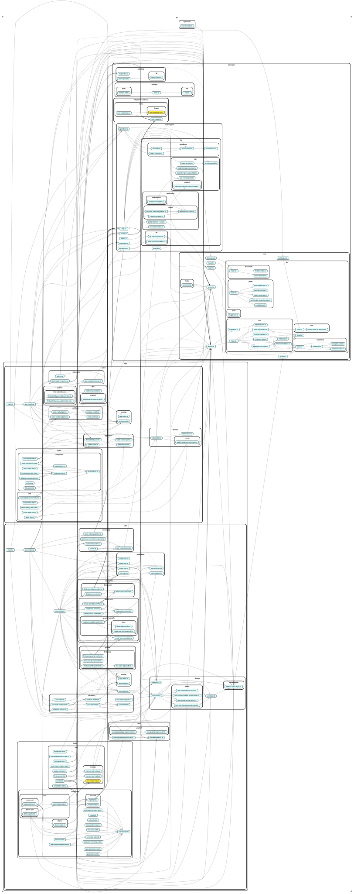

# Domain-Driven Hexagon Scaffold

< [English](README.md) | Português (Brasil) >

[](https://github.com/danilomartinelli/vibecoding-starter-js/actions/workflows/ci.yml)
[](LICENSE)

Adote este scaffold com o [guia de renomeação do projeto](docs/adoption.md).
Guia e exemplos originais: [Sairyss/domain-driven-hexagon](https://github.com/Sairyss/domain-driven-hexagon), MIT; veja os [avisos de terceiros](THIRD_PARTY_NOTICES.md).

**Recursos upstream de [Sairyss](https://github.com/Sairyss)**:

- [Backend best practices](https://github.com/Sairyss/backend-best-practices) - Boas práticas, ferramentas e diretrizes para desenvolvimento backend.
- [System Design Patterns](https://github.com/Sairyss/system-design-patterns) - lista de tópicos e recursos relacionados a sistemas distribuídos, design de sistemas, microsserviços, escalabilidade, desempenho etc.
- [Full Stack starter template](https://github.com/Sairyss/fullstack-starter-template) - template para aplicações full stack baseado em TypeScript, React, Vite, ChakraUI, tRPC, Fastify, Prisma, zod etc.

---

O foco principal deste projeto é fornecer recomendações sobre como projetar aplicações de software. Este readme reúne técnicas, ferramentas, boas práticas, padrões arquiteturais e diretrizes coletados de diferentes fontes.

Os exemplos de código rodam diretamente no [Bun](https://bun.com/) **1.4.2** usando [TypeScript](https://www.typescriptlang.org/), o framework [NestJS](https://docs.nestjs.com/) e o [Slonik](https://github.com/gajus/slonik) para o acesso ao banco de dados.

Instale as dependências com o **Bun 1.4.2** usando `bun install --frozen-lockfile`.
Execute as [verificações de desenvolvimento](docs/developer-checks.md) individuais para tipos estritos,
lint, formatação e arquitetura.
Os comandos de banco de dados também rodam diretamente no Bun. Consulte o [guia de banco de dados](docs/database.md)
para PostgreSQL local, migrações SQL e seeds.
Com o Docker em execução, `make dev` prepara a infraestrutura local, migra os dois
bancos de dados e executa as aplicações User e Wallet em modo watch; `make down`
para a infraestrutura e preserva seus dados. `make test` executa os casos Gherkin
existentes e as regressões do sistema em infraestrutura isolada, e `make check`
executa o gate local completo. `bun run test:unit` executa as suítes sem dependência de infraestrutura. Consulte o
[guia de runtime](docs/runtime.md) para configuração, checagem de tipos e os sete casos Gherkin
originais, além das regressões de rollback com banco de dados real.
O [inventário de dependências](docs/dependencies.md) registra as versões compatíveis e as
correções de segurança. Execute `bun audit` separadamente para verificar novamente toda a árvore de dependências.
O [workspace Nx](docs/nx-workspace.md) orquestra as aplicações independentes User e Wallet,
os pacotes técnicos privados e as regressões. A migração entregue está registrada no
[status de implementação do ADR 0002](docs/adr/0002-adopt-nx-with-nest-and-bun.md#implementation-status)
e no seu [mapa de evidências](docs/migration-evidence.md).

Os padrões e princípios apresentados aqui são **agnósticos de framework/linguagem**. Portanto, as tecnologias acima podem ser facilmente substituídas por qualquer alternativa. Não importa a linguagem ou o framework utilizado: qualquer aplicação pode se beneficiar dos princípios descritos abaixo.

**Observação**: os exemplos de código estão adaptados ao TypeScript e aos frameworks mencionados acima. <br/>
(Implementações em outras linguagens terão uma aparência diferente)

**Tudo o que está abaixo é uma recomendação, não uma regra**. Projetos diferentes têm requisitos diferentes, então qualquer padrão mencionado neste readme deve ser ajustado às necessidades do projeto ou até mesmo descartado por completo se não fizer sentido. Em aplicações reais em produção, você provavelmente vai precisar de apenas uma fração desses padrões, dependendo dos seus casos de uso. Mais informações [nesta](#recomendações-gerais-sobre-arquiteturas-boas-práticas-padrões-de-projeto-e-princípios) seção.

---

- [Domain-Driven Hexagon Scaffold](#domain-driven-hexagon-scaffold)
- [Arquitetura](#arquitetura)
  - [Prós](#prós)
  - [Contras](#contras)
- [Diagrama](#diagrama)
- [Módulos](#módulos)
- [Núcleo da aplicação](#núcleo-da-aplicação)
- [Camada de aplicação](#camada-de-aplicação)
  - [Serviços de aplicação](#serviços-de-aplicação)
  - [Commands e Queries](#commands-e-queries)
    - [Commands](#commands)
    - [Queries](#queries)
  - [Portas (Ports)](#portas)
- [Camada de domínio](#camada-de-domínio)
  - [Entidades](#entidades)
  - [Agregados](#agregados)
  - [Eventos de domínio](#eventos-de-domínio)
  - [Eventos de integração](#eventos-de-integração)
  - [Serviços de domínio](#serviços-de-domínio)
  - [Objetos de valor (Value Objects)](#objetos-de-valor-value-objects)
  - [Invariantes de domínio](#invariantes-de-domínio)
    - [Substituindo tipos primitivos por Objetos de valor](#substituindo-tipos-primitivos-por-objetos-de-valor)
    - [Torne estados ilegais irrepresentáveis](#torne-estados-ilegais-irrepresentáveis)
      - [Validação em tempo de compilação](#validação-em-tempo-de-compilação)
      - [Validação em tempo de execução](#validação-em-tempo-de-execução)
    - [Proteção (guarding) vs. validação](#proteção-guarding-vs-validação)
  - [Erros de domínio](#erros-de-domínio)
  - [Usando bibliotecas dentro do núcleo da aplicação](#usando-bibliotecas-dentro-do-núcleo-da-aplicação)
- [Adaptadores de interface](#adaptadores-de-interface)
  - [Controllers](#controllers)
    - [Resolvers](#resolvers)
  - [DTOs](#dtos)
    - [DTOs de requisição](#dtos-de-requisição)
    - [DTOs de resposta](#dtos-de-resposta)
    - [Recomendações adicionais](#recomendações-adicionais)
    - [DTOs locais](#dtos-locais)
- [Camada de infraestrutura](#camada-de-infraestrutura)
  - [Adaptadores](#adaptadores)
  - [Repositórios](#repositórios)
  - [Modelos de persistência](#modelos-de-persistência)
  - [Outras coisas que podem fazer parte da camada de infraestrutura](#outras-coisas-que-podem-fazer-parte-da-camada-de-infraestrutura)
- [Outras recomendações](#outras-recomendações)
  - [Recomendações gerais sobre arquiteturas, boas práticas, padrões de projeto e princípios](#recomendações-gerais-sobre-arquiteturas-boas-práticas-padrões-de-projeto-e-princípios)
  - [Recomendações para APIs menores](#recomendações-para-apis-menores)
  - [Testes comportamentais](#testes-comportamentais)
  - [Estrutura de pastas e arquivos](#estrutura-de-pastas-e-arquivos)
    - [Nomes de arquivos](#nomes-de-arquivos)
  - [Garantindo a arquitetura](#garantindo-a-arquitetura)
  - [Evite cadeias de herança extensas](#evite-cadeias-de-herança-extensas)
- [Recursos adicionais](#recursos-adicionais)
  - [Artigos](#artigos)
  - [Sites](#sites)
  - [Blogs](#blogs)
  - [Vídeos](#vídeos)
  - [Livros](#livros)

# Arquitetura

Esta é uma tentativa de combinar vários padrões e estilos arquiteturais, como:

- [Domain-Driven Design (DDD)](https://en.wikipedia.org/wiki/Domain-driven_design)
- [Arquitetura Hexagonal (Portas e Adaptadores / Ports and Adapters)](<https://en.wikipedia.org/wiki/Hexagonal_architecture_(software)>)
- [Secure by Design](https://www.manning.com/books/secure-by-design)
- [Clean Architecture](https://blog.cleancoder.com/uncle-bob/2012/08/13/the-clean-architecture.html)
- [Onion Architecture](https://herbertograca.com/2017/09/21/onion-architecture/)
- [Princípios SOLID](https://en.wikipedia.org/wiki/SOLID)
- [Padrões de projeto de software](https://refactoring.guru/design-patterns/what-is-pattern)

E muitos outros (mais links abaixo, em cada capítulo).

Antes de começarmos, aqui estão os PRÓS e CONTRAS de usar uma arquitetura completa como esta:

#### Prós

- Independente de frameworks externos, tecnologias, bancos de dados etc. Frameworks e recursos externos podem ser plugados/desplugados com muito menos esforço.
- Fácil de testar e de escalar.
- Mais segura. Alguns princípios de segurança já vêm embutidos no próprio design.
- A solução pode ser desenvolvida e mantida por times diferentes, sem que um atrapalhe o trabalho do outro.
- Mais fácil adicionar novas funcionalidades. À medida que o sistema cresce ao longo do tempo, a dificuldade de adicionar novas funcionalidades permanece constante e relativamente pequena.
- Se a solução for dividida corretamente seguindo os limites de cada [bounded context](https://martinfowler.com/bliki/BoundedContext.html), fica fácil converter partes dela em microsserviços, se necessário.

#### Contras

- Esta é uma arquitetura sofisticada, que exige um entendimento sólido de princípios de software de qualidade, como SOLID, Clean Architecture/Arquitetura Hexagonal, Domain-Driven Design etc. Qualquer time que implemente uma solução como essa quase certamente vai precisar de um especialista para conduzi-la e evitar que ela evolua na direção errada e acumule dívida técnica.

- Algumas práticas apresentadas aqui não são recomendadas para aplicações de pequeno e médio porte com pouca lógica de negócio. Há uma complexidade inicial adicional para dar suporte a todos esses blocos de construção e camadas, código boilerplate, abstrações, mapeamento de dados etc. Assim, implementar uma arquitetura completa como esta geralmente não é adequado para aplicações [CRUD](https://en.wikipedia.org/wiki/Create,_read,_update_and_delete) simples e pode complicar demais esse tipo de solução. Alguns princípios descritos abaixo podem ser usados em aplicações menores, mas só devem ser implementados depois de analisar e entender todos os prós e contras.

# Diagrama


<sup>O diagrama é baseado principalmente [neste aqui](https://github.com/hgraca/explicit-architecture-php#explicit-architecture-1) + outros encontrados online</sup>

Em resumo, o fluxo de dados é o seguinte (da esquerda para a direita):

- Uma requisição/comando de CLI/evento é enviado ao controller usando um DTO simples;
- O controller faz o parse desse DTO, mapeia-o para o formato de um objeto Command/Query e o repassa a um serviço de aplicação;
- O serviço de aplicação trata esse Command/Query; ele executa a lógica de negócio usando serviços de domínio e entidades/agregados e utiliza a camada de infraestrutura por meio de portas (interfaces);
- A camada de infraestrutura mapeia os dados para o formato de que precisa, busca/persiste dados em um banco de dados, usa adaptadores para outras comunicações de I/O (como enviar um evento para um broker externo ou chamar APIs externas), mapeia os dados de volta para o formato de domínio e os devolve ao serviço de aplicação;
- Depois que o serviço de aplicação termina seu trabalho, ele devolve os dados/a confirmação aos controllers;
- Os controllers devolvem os dados ao usuário (se a aplicação tiver presenters/views, são eles que são retornados).

Cada camada é responsável pela sua própria lógica e tem blocos de construção que normalmente devem seguir o [Princípio da responsabilidade única](https://en.wikipedia.org/wiki/Single-responsibility_principle) quando possível e quando fizer sentido (por exemplo, usar `Repositories` apenas para acesso ao banco de dados, usar `Entities` para a lógica de negócio etc.).

**Tenha em mente** que projetos diferentes podem ter mais ou menos etapas/camadas/blocos de construção do que os descritos aqui. Adicione mais se a aplicação exigir e dispense alguns se a aplicação não for tão complexa e não precisar de toda essa abstração.

Recomendação geral para qualquer projeto: analise o quão grande/complexa a aplicação vai ser, encontre um meio-termo e use tantas camadas/blocos de construção quantos forem necessários para o projeto, dispensando os que possam complicar demais as coisas.

Mais detalhes sobre cada etapa abaixo.

# Módulos

Os exemplos de código deste projeto usam separação por módulos (também chamados de componentes). O nome de cada módulo deve refletir um conceito importante do domínio, e cada módulo deve ter sua própria pasta com uma base de código dedicada. Cada caso de uso de negócio dentro desse módulo ganha sua própria pasta para armazenar a maior parte do que precisa (isso também é chamado de _Vertical Slicing_). É mais fácil trabalhar em coisas que mudam juntas se elas estiverem agrupadas relativamente próximas umas das outras. Pense em um módulo como uma "caixa" que agrupa lógica de negócio relacionada.

Usar módulos é uma ótima forma de [encapsular](<https://en.wikipedia.org/wiki/Encapsulation_(computer_programming)>) partes de regras de domínio de negócio altamente [coesas](<https://en.wikipedia.org/wiki/Cohesion_(computer_science)>).

Tente tornar cada módulo independente e manter as interações entre módulos no mínimo. Pense em cada módulo como uma mini aplicação delimitada por um único contexto. Considere os detalhes internos do módulo como privados e tente evitar imports diretos entre módulos (como importar uma classe `import SomeClass from '../SomeOtherModule'`), pois isso cria [acoplamento forte](<https://en.wikipedia.org/wiki/Coupling_(computer_programming)>) e pode transformar seu código em [espaguete](https://en.wikipedia.org/wiki/Spaghetti_code) e sua aplicação em uma [grande bola de lama (big ball of mud)](https://en.wikipedia.org/wiki/Big_ball_of_mud).

Algumas dicas para evitar acoplamento:

- Tente não criar dependências entre módulos ou casos de uso. Em vez disso, mova a lógica compartilhada para arquivos separados e faça ambos dependerem deles, em vez de dependerem um do outro.
- Os módulos podem cooperar por meio de um [mediator](https://en.wikipedia.org/wiki/Mediator_pattern#:~:text=In%20software%20engineering%2C%20the%20mediator,often%20consist%20of%20many%20classes.) ou de uma [facade](https://en.wikipedia.org/wiki/Facade_pattern) pública, ocultando todos os detalhes internos privados do módulo para evitar seu uso indevido e dando acesso público apenas às partes da funcionalidade que devem ser públicas.
- Como alternativa, os módulos podem se comunicar entre si por meio de mensagens. Por exemplo, você pode enviar commands usando um barramento de commands (commands bus) ou se inscrever em eventos que outros módulos emitem (mais informações sobre eventos e commands bus abaixo).

Isso garante [baixo acoplamento](https://en.wikipedia.org/wiki/Loose_coupling): a refatoração dos detalhes internos de um módulo fica mais fácil, porque o mundo externo depende apenas da interface pública do módulo; e, se os bounded contexts forem definidos e projetados corretamente, cada módulo pode ser facilmente separado em um microsserviço, se necessário, sem mexer em nenhuma lógica de domínio nem exigir uma grande refatoração.

Mantenha seus módulos pequenos. Você deve ser capaz de reescrever um módulo em um período de tempo relativamente curto. Isso se aplica não só ao padrão de módulos, mas ao desenvolvimento de software em geral: objetos, funções, microsserviços, processos etc. Mantenha-os pequenos e combináveis. Isso é incrivelmente poderoso no ambiente de desenvolvimento de software, que está em constante mudança, pois, quando seus requisitos mudam, alterar módulos pequenos é muito mais fácil do que alterar um programa grande. Você pode simplesmente apagar um módulo e reescrevê-lo do zero em questão de dias. Essa ideia é descrita em mais detalhes nesta palestra: [Greg Young - The art of destroying software](https://youtu.be/Ed94CfxgsCA).

Exemplos de código:

- Confira a estrutura do diretório [src/apps](src/apps).
- [src/apps/user/commands](src/apps/user/commands) - o diretório "commands" no módulo de usuário inclui os casos de uso de negócio (commands) que um módulo pode executar, cada um com seu próprio Vertical Slice.

Leia mais:

- [Modular programming: Beyond the spaghetti mess](https://www.tiny.cloud/blog/modular-programming-principle/).
- [What are Modules in Domain Driven Design?](https://www.culttt.com/2014/12/10/modules-domain-driven-design/)
- [How to Implement Vertical Slice Architecture](https://garywoodfine.com/implementing-vertical-slice-architecture/)

Cada módulo é composto pelas camadas descritas abaixo.

# Núcleo da aplicação

Este é o núcleo do sistema, construído com os [blocos de construção do DDD](https://dzone.com/articles/ddd-part-ii-ddd-building-blocks):

**Camada de domínio**:

- Entidades
- Agregados
- Serviços de domínio
- Objetos de valor (Value Objects)
- Erros de domínio

**Camada de aplicação**:

- Serviços de aplicação
- Commands e Queries
- Portas

**Observação**: implementações diferentes podem ter estruturas de camadas ligeiramente diferentes, dependendo das necessidades de cada aplicação. Além disso, mais camadas e blocos de construção podem ser adicionados se necessário.

---

# Camada de aplicação

## Serviços de aplicação

Serviços de aplicação (também chamados de "Workflow Services", "Use Cases", "Interactors" etc.) são usados para orquestrar os passos necessários para cumprir os comandos impostos pelo cliente.

Serviços de aplicação:

- Normalmente são usados para orquestrar como o mundo externo interage com a sua aplicação e executa as tarefas exigidas pelos usuários finais;
- Não contêm lógica de negócio específica do domínio;
- Operam sobre tipos escalares, transformando-os em tipos do domínio. Um tipo escalar pode ser considerado qualquer tipo desconhecido pelo modelo de domínio. Isso inclui tipos primitivos e tipos que não pertencem ao domínio;
- Usam portas para declarar dependências de serviços/adaptadores de infraestrutura necessários para executar a lógica de domínio (portas são apenas interfaces; vamos discutir esse tema em detalhes mais abaixo);
- Buscam `Entities`/`Aggregates` do domínio (ou qualquer outra coisa) no banco de dados/em APIs externas (por meio de portas/interfaces, com implementações concretas injetadas pela biblioteca de [DI](https://en.wikipedia.org/wiki/Dependency_injection));
- Executam a lógica de domínio nessas `Entities`/`Aggregates` (invocando seus métodos);
- Ao trabalhar com várias `Entities`/`Aggregates`, usam um `Domain Service` para orquestrá-las;
- Executam outras comunicações fora do processo por meio de Portas (como emissão de eventos, envio de e-mails etc.);
- Podem ser usados como handlers de `Command`/`Query`;
- Não devem depender de outros serviços de aplicação, pois isso pode causar problemas (como dependências cíclicas);

Ter um serviço por caso de uso é considerado uma boa prática.

<details>
<summary>O que são "casos de uso"?</summary>

[wiki](https://en.wikipedia.org/wiki/Use_case):

> Em engenharia de software e de sistemas, um caso de uso é uma lista de ações ou passos de eventos que normalmente define as interações entre um papel (conhecido na Unified Modeling Language como ator) e um sistema para atingir um objetivo.

Casos de uso são, em termos simples, a lista de ações exigidas de uma aplicação.

---

</details>

Arquivo de exemplo: [create-user.service.ts](src/apps/user/commands/create-user/create-user.service.ts)

Mais sobre serviços:

- [Domain-Application-Infrastructure Services pattern](https://badia-kharroubi.gitbooks.io/microservices-architecture/content/patterns/tactical-patterns/domain-application-infrastructure-services-pattern.html)
- [Services in DDD finally explained](https://developer20.com/services-in-ddd-finally-explained/)

## Commands e Queries

Esse princípio se chama [Command–Query Separation(CQS)](https://en.wikipedia.org/wiki/Command%E2%80%93query_separation). Sempre que possível, os métodos devem ser separados em `Commands` (operações que alteram estado) e `Queries` (operações de leitura de dados). Para deixar clara a distinção entre esses dois tipos de operação, os objetos de entrada podem ser representados como `Commands` e `Queries`. Antes de o DTO chegar ao domínio, ele é convertido em um objeto `Command`/`Query`.

### Commands

`Command` é um objeto que sinaliza a intenção do usuário, por exemplo `CreateUserCommand`. Ele descreve uma única ação (mas não a executa).

`Commands` são usados para ações que alteram estado, como criar um novo usuário e salvá-lo no banco de dados. As operações de criação, atualização e exclusão (Create, Update e Delete) são consideradas operações que alteram estado.

A leitura de dados é responsabilidade das `Queries`, então métodos de `Command` não devem retornar dados de negócio.

Alguns puristas de CQS podem dizer que um `Command` não deveria retornar absolutamente nada. Mas você vai precisar pelo menos do ID de um item criado para acessá-lo depois. Para isso, você pode deixar que os clientes gerem um [UUID](https://en.wikipedia.org/wiki/Universally_unique_identifier) (mais informações aqui: [CQS versus server generated IDs](https://blog.ploeh.dk/2014/08/11/cqs-versus-server-generated-ids/)).

Ainda assim, violar essa regra e retornar alguns metadados, como o `ID` de um item criado, um link de redirecionamento, uma mensagem de confirmação, um status ou outros metadados, é uma abordagem mais prática do que seguir dogmas.

**Observação**: `Command` é parecido, mas não é a mesma coisa que o descrito aqui: [Command Pattern](https://refactoring.guru/design-patterns/command). Existem várias definições pela internet, com implementações parecidas, mas ligeiramente diferentes.

Para executar um command, você pode usar um `Command Bus` em vez de importar um serviço diretamente. Isso desacopla o Invoker de um command do seu Receiver, permitindo que você envie seus commands de qualquer lugar sem criar acoplamento.

Evite que command handlers executem outros commands desta forma: Command → Command. Em vez disso, use eventos para esse fim e execute os próximos commands da cadeia em um handler de eventos: Command → Event → Command.

Arquivos de exemplo:

- [create-user.command.ts](src/apps/user/commands/create-user/create-user.command.ts) - um objeto de command
- [create-user.http.controller.ts](src/apps/user/commands/create-user/create-user.http.controller.ts) - o controller executa um command usando um command bus. Isso o desacopla do command handler.
- [create-user.service.ts](src/apps/user/commands/create-user/create-user.service.ts) - um command handler.

Leia mais:

- [What is a command bus and why should you use it?](https://barryvanveen.nl/blog/49-what-is-a-command-bus-and-why-should-you-use-it)
- [Why You Should Avoid Command Handlers Calling Other Commands?](https://www.rahulpnath.com/blog/avoid-commands-calling-commands/)

### Queries

`Query` é parecida com um `Command`. Ela pertence a um modelo de leitura, sinaliza a intenção do usuário de encontrar algo e descreve como fazer isso.

`Query` é apenas uma operação de leitura de dados e não deve fazer nenhuma alteração de estado (como escritas no banco de dados, em arquivos, em APIs de terceiros etc.). Por esse motivo, no modelo de leitura podemos ignorar completamente as camadas de domínio e de repositório: uma query retorna um modelo de leitura dedicado por meio de uma porta de leitura pertencente à aplicação, e somente o adaptador de saída executa SQL.

Assim como os Commands, as Queries podem usar um `Query Bus` se necessário. Dessa forma, você pode consultar qualquer coisa de qualquer lugar sem importar classes diretamente e evita acoplamento.

Arquivos de exemplo:

- [find-users.ts](src/apps/user/application/find-users.ts) - uma query e um caso de uso simples. Ela é dona da sua [porta de leitura e do modelo de leitura](src/apps/user/application/user-read.port.ts), sem usar objetos de domínio ou repositórios (mais informações [aqui](https://codeopinion.com/should-you-use-the-repository-pattern-with-cqrs-yes-and-no/)).
- [user-read.adapter.ts](src/apps/user/database/user-read.adapter.ts) - o adaptador de saída que executa SQL, valida as linhas e as mapeia para o modelo de leitura.
- [find-users.query-handler.ts](src/apps/user/queries/find-users/find-users.query-handler.ts) - um query handler do Nest CQRS que delega ao caso de uso. Os adaptadores REST e GraphQL mapeiam o modelo de leitura, nunca o modelo de persistência.

---

Ao impor a separação entre `Command` e `Query`, o código fica mais simples de entender. Um altera algo, o outro apenas lê dados.

Além disso, seguir CQS desde o início facilita separar os modelos de escrita e de leitura em bancos de dados diferentes, caso um dia essa necessidade surja.

**Observação**: este repositório usa o pacote [NestJS CQRS](https://docs.nestjs.com/recipes/cqrs), que fornece um command/query bus.

Leia mais sobre CQS e CQRS:

- [Command Query Segregation](https://khalilstemmler.com/articles/oop-design-principles/command-query-segregation/).
- [Exposing CQRS Through a RESTful API](https://www.infoq.com/articles/rest-api-on-cqrs/)
- [What is the CQRS pattern?](https://docs.microsoft.com/en-us/azure/architecture/patterns/cqrs)
- [CQRS and REST: the perfect match](https://lostechies.com/jimmybogard/2016/06/01/cqrs-and-rest-the-perfect-match/)

---

## Portas

Portas são interfaces que definem contratos que devem ser implementados por adaptadores. Por exemplo, uma porta pode abstrair detalhes de tecnologia (como o tipo de banco de dados usado para buscar alguns dados), e a camada de infraestrutura pode implementar um adaptador para executar alguma ação mais relacionada a detalhes de tecnologia do que à lógica de negócio. Portas funcionam como [abstrações](<https://en.wikipedia.org/wiki/Abstraction_(computer_science)>) para detalhes de tecnologia com os quais a lógica de negócio não se importa. O nome "porta" é usado com mais frequência na [Arquitetura Hexagonal](<https://en.wikipedia.org/wiki/Hexagonal_architecture_(software)>).

No Núcleo da aplicação, **as dependências apontam para dentro**. Camadas externas podem depender de camadas internas, mas camadas internas nunca dependem de camadas externas. O Núcleo da aplicação não deve depender de frameworks nem acessar recursos externos diretamente. Quaisquer chamadas externas a recursos fora do processo/leituras de dados de processos remotos devem ser feitas por meio de `ports` (interfaces), com as implementações das classes criadas em algum lugar da camada de infraestrutura e injetadas no núcleo da aplicação ([Injeção de Dependência](https://en.wikipedia.org/wiki/Dependency_injection) e [Inversão de Dependência](https://en.wikipedia.org/wiki/Dependency_inversion_principle)). Isso torna a lógica de negócio independente de tecnologia, facilita os testes e permite conectar/desconectar/trocar quaisquer recursos externos com facilidade, tornando a aplicação modular e [fracamente acoplada](https://en.wikipedia.org/wiki/Loose_coupling).

- Portas são basicamente apenas interfaces que definem o que precisa ser feito, sem se importar com como é feito.
- Portas podem ser criadas para abstrair do domínio efeitos colaterais, como operações de I/O e acesso ao banco de dados, detalhes de tecnologia, bibliotecas invasivas, código legado etc.
- Ao abstrair efeitos colaterais, você pode testar a lógica da sua aplicação de forma isolada, [mockando](https://en.wikipedia.org/wiki/Mock_object) a implementação. Isso pode ser útil para [testes unitários](https://en.wikipedia.org/wiki/Unit_testing).
- Portas devem ser criadas para atender às necessidades do domínio, e não simplesmente imitar as APIs das ferramentas.
- Implementações mock podem ser passadas para as portas durante os testes. Usar mocks deixa seus testes mais rápidos e independentes do ambiente.
- A abstração fornecida pelas portas pode ser usada para injetar implementações diferentes em uma porta, se necessário ([polimorfismo](<https://en.wikipedia.org/wiki/Polymorphism_(computer_science)>)).
- Ao projetar portas, lembre-se do [Princípio da Segregação de Interfaces](https://en.wikipedia.org/wiki/Interface_segregation_principle). Divida interfaces grandes em interfaces menores quando fizer sentido, mas também tome cuidado para não exagerar quando não for necessário.
- Portas também podem ajudar a adiar decisões. A camada de domínio pode ser implementada antes mesmo de decidir quais tecnologias (frameworks, bancos de dados etc.) serão usadas.

**Observação**: como a maioria das implementações de portas é injetada e executada no serviço de aplicação, a camada de aplicação pode ser um bom lugar para manter essas portas. Mas há casos em que a lógica de negócio da camada de domínio depende da execução de algum recurso externo; nesses casos, essas portas podem ficar na camada de domínio.

**Observação**: abusar de portas/interfaces pode levar a [abstrações desnecessárias](https://mortoray.com/2014/08/01/the-false-abstraction-antipattern/) e complicar demais a sua aplicação. Em muitos casos, é totalmente aceitável depender de uma implementação concreta em vez de abstraí-la com uma interface. Pense com cuidado se você realmente precisa de uma abstração antes de usá-la.

Arquivos de exemplo:

- [repository.port.ts](src/packages/core/lib/ddd/repository.port.ts) - porta genérica para repositórios
- [user.repository.port.ts](src/apps/user/database/user.repository.port.ts) - uma porta para o repositório de usuários
- [user-write.port.ts](src/apps/user/application/user-write.port.ts) - portas da aplicação para persistência de usuários e registro de fatos em um escopo atômico; os casos de uso de User dependem dessas interfaces
- [logger.port.ts](src/packages/core/lib/ports/logger.port.ts) - outro exemplo de porta, desta vez para o logger da aplicação

Leia mais:

- [A Color Coded Guide to Ports and Adapters](https://8thlight.com/blog/damon-kelley/2021/05/18/a-color-coded-guide-to-ports-and-adapters.html)

---

# Camada de domínio

Esta camada contém as regras de negócio da aplicação.

O domínio deve operar usando objetos de domínio descritos pela [linguagem ubíqua](https://martinfowler.com/bliki/UbiquitousLanguage.html). Os blocos de construção de domínio mais importantes estão descritos abaixo.

- [Developing the ubiquitous language](https://medium.com/@felipefreitasbatista/developing-the-ubiquitous-language-1382b720bb8c)

## Entidades

Entidades são o núcleo do domínio. Elas encapsulam regras de negócio e atributos válidos para toda a organização. Uma entidade pode ser um objeto com propriedades e métodos, ou pode ser um conjunto de estruturas de dados e funções.

Entidades representam modelos de negócio e expressam quais propriedades um determinado modelo tem, o que ele pode fazer, quando e em quais condições pode fazê-lo. Exemplos de modelos de negócio são User, Product, Booking, Ticket, Wallet etc.

Entidades devem sempre proteger suas [invariantes](https://en.wikipedia.org/wiki/Class_invariant):

> Entidades de domínio devem ser sempre entidades válidas. Há um certo número de invariantes de um objeto que devem ser sempre verdadeiras. Por exemplo, um objeto de item de pedido sempre precisa ter uma quantidade que deve ser um número inteiro positivo, além de um nome de artigo e um preço. Portanto, garantir as invariantes é responsabilidade das entidades de domínio (especialmente da raiz do agregado (aggregate root)), e um objeto de entidade não deve poder existir sem ser válido.

Entidades:

- Contêm a lógica de negócio do domínio. Evite ter lógica de negócio nos seus serviços sempre que possível, pois isso leva a um [Anemic Domain Model](https://martinfowler.com/bliki/AnemicDomainModel.html) (Serviços de domínio são uma exceção, para lógica de negócio que não cabe em uma única entidade).
- Têm uma identidade que as define e as distingue das demais. Essa identidade se mantém consistente durante todo o seu ciclo de vida.
- A igualdade entre duas entidades é determinada comparando seus identificadores (geralmente o campo `id`).
- Podem conter outros objetos, como outras entidades ou objetos de valor.
- São responsáveis por reunir em um mesmo lugar todo o entendimento sobre o estado e sobre como ele muda.
- São responsáveis por coordenar as operações sobre os objetos que possuem.
- Não sabem nada sobre as camadas superiores (serviços, controllers etc.).
- Os dados das entidades de domínio devem ser modelados para acomodar a lógica de negócio, e não algum schema de banco de dados.
- Entidades devem proteger suas invariantes; tente evitar setters públicos - atualize o estado usando métodos e execute a validação das invariantes a cada atualização, se necessário (pode ser um simples método `validate()` que verifica se as regras de negócio não foram violadas pela atualização).
- Devem ser consistentes na criação. Valide entidades e outros objetos de domínio na criação e lance um erro na primeira falha. [Fail Fast](https://en.wikipedia.org/wiki/Fail-fast).
- Evite construtores sem argumentos (vazios); aceite e valide todas as propriedades obrigatórias em um construtor (ou em um [factory method](https://en.wikipedia.org/wiki/Factory_method_pattern) como `create()`).
- Para propriedades opcionais que exigem alguma configuração complexa, podem ser usados [Fluent interface](https://en.wikipedia.org/wiki/Fluent_interface) e [Builder Pattern](https://refactoring.guru/design-patterns/builder).
- Torne as entidades parcialmente imutáveis. Identifique quais propriedades não devem mudar após a criação e torne-as `readonly` (por exemplo, `id` ou `createdAt`).

**Observação**: muita gente tende a criar um módulo por entidade, mas essa abordagem não é muito boa. Cada módulo pode ter várias entidades. Algo a ter em mente é que colocar entidades em um único módulo exige que elas tenham lógica de negócio relacionada; não agrupe entidades não relacionadas em um mesmo módulo.

Arquivos de exemplo:

- [user.entity.ts](src/apps/user/domain/user.entity.ts)
- [wallet.entity.ts](src/apps/wallet/domain/wallet.entity.ts)

Leia mais:

- [Domain Entity pattern](https://badia-kharroubi.gitbooks.io/microservices-architecture/content/patterns/tactical-patterns/domain-entity-pattern.html)
- [Secure by design: Chapter 6 Ensuring integrity of state](https://livebook.manning.com/book/secure-by-design/chapter-6/)

---

## Agregados

Um [Agregado](https://martinfowler.com/bliki/DDD_Aggregate.html) é um conjunto de objetos de domínio que pode ser tratado como uma única unidade. Ele encapsula entidades e objetos de valor que, conceitualmente, pertencem ao mesmo conjunto. Ele também contém um conjunto de operações com as quais esses objetos de domínio podem ser manipulados.

- Agregados ajudam a simplificar o modelo de domínio, reunindo vários objetos de domínio sob uma única abstração.
- Agregados não devem ser influenciados pelo modelo de dados. Associações entre objetos de domínio não são a mesma coisa que relacionamentos no banco de dados.
- A raiz do agregado (aggregate root) é uma entidade que contém outras entidades/objetos de valor e toda a lógica para manipulá-los.
- A raiz do agregado tem identidade global ([UUID / GUID](https://en.wikipedia.org/wiki/Universally_unique_identifier) / chave primária). Entidades dentro da fronteira do agregado têm identidades locais, únicas apenas dentro do agregado.
- A raiz do agregado é a porta de entrada para todo o agregado. Quaisquer referências vindas de fora do agregado devem ir **apenas** para a raiz do agregado.
- Quaisquer operações sobre um agregado devem ser [operações transacionais](https://en.wikipedia.org/wiki/Database_transaction). Ou tudo é salvo/atualizado/excluído, ou nada é.
- Apenas raízes de agregado podem ser obtidas diretamente com consultas ao banco de dados. Todo o resto deve ser feito por navegação a partir delas.
- Assim como as `Entities`, os agregados devem proteger suas invariantes durante todo o ciclo de vida. Quando uma alteração em qualquer objeto dentro da fronteira do agregado é confirmada, todas as invariantes do agregado inteiro devem ser satisfeitas. Em termos simples, todos os objetos de um agregado devem ser consistentes, ou seja, se um objeto dentro de um agregado muda de estado, isso não deve entrar em conflito com outros objetos de domínio dentro desse agregado (isso é chamado de _Consistency Boundary_, ou fronteira de consistência).
- Objetos dentro do agregado podem referenciar outras raízes de agregado por meio do seu identificador globalmente único (id). Evite manter uma referência direta ao objeto.
- Tente evitar agregados grandes demais, pois isso pode levar a problemas de desempenho e de manutenção.
- Agregados podem publicar `Domain Events` (mais sobre isso abaixo).

Todas essas regras vêm simplesmente da ideia de criar uma fronteira ao redor dos agregados. A fronteira simplifica o modelo de negócio, pois nos obriga a considerar cada relacionamento com muito cuidado e dentro de um conjunto de regras bem definido.

Resumindo, se você combina várias entidades e objetos de valor relacionados dentro de uma `Entity` raiz, essa `Entity` raiz se torna uma `Aggregate Root`, e esse conjunto de entidades e objetos de valor relacionados se torna um `Aggregate`.

Arquivos de exemplo:

- [aggregate-root.base.ts](src/packages/core/lib/ddd/aggregate-root.base.ts) - classe base abstrata.
- [user.entity.ts](src/apps/user/domain/user.entity.ts) - agregados são apenas entidades que precisam seguir um conjunto de regras específicas descritas acima.

Leia mais:

- [Understanding Aggregates in Domain-Driven Design](https://dzone.com/articles/domain-driven-design-aggregate)
- [What Are Aggregates In Domain-Driven Design?](https://www.jamesmichaelhickey.com/domain-driven-design-aggregates/) <- esta é uma série de vários artigos; não se esqueça de clicar em "Next article" no final.
- [Effective Aggregate Design Part I: Modeling a Single Aggregate](https://www.dddcommunity.org/wp-content/uploads/files/pdf_articles/Vernon_2011_1.pdf)
- [Effective Aggregate Design Part II: Making Aggregates Work Together](https://www.dddcommunity.org/wp-content/uploads/files/pdf_articles/Vernon_2011_2.pdf)

---

## Eventos de domínio

Um Evento de domínio indica que algo aconteceu em um domínio e que você quer que outras partes do mesmo domínio (no mesmo processo) fiquem sabendo. Eventos de domínio são apenas mensagens enviadas para um dispatcher de Eventos de domínio em memória.

Por exemplo, se um usuário compra algo, você pode querer:

- Atualizar o carrinho de compras dele;
- Sacar dinheiro da carteira dele;
- Criar um novo pedido de envio;
- Realizar outras operações de domínio que não são responsabilidade do agregado que executa o command de "compra".

A abordagem típica envolve executar toda essa lógica em um serviço que realiza a operação de "compra". No entanto, isso cria acoplamento entre diferentes subdomínios.

Uma abordagem alternativa seria publicar um `Domain Event`. Se a execução de um command relacionado a uma instância de agregado exigir que regras de domínio adicionais sejam executadas em um ou mais agregados, você pode projetar e implementar esses efeitos colaterais para que sejam disparados por Eventos de domínio. A propagação de mudanças de estado entre vários agregados dentro do mesmo modelo de domínio pode ser feita assinando um `Domain Event` concreto e criando quantos handlers de eventos forem necessários. Isso evita acoplamento entre agregados.

Eventos de domínio podem ser úteis para criar um [log de auditoria](https://en.wikipedia.org/wiki/Audit_trail) que rastreie todas as alterações em entidades importantes, salvando cada evento no banco de dados. Leia mais sobre por que logs de auditoria podem ser úteis: [Why soft deletes are evil and what to do instead](https://jameshalsall.co.uk/posts/why-soft-deletes-are-evil-and-what-to-do-instead).

Todas as alterações causadas por Eventos de domínio em vários agregados dentro de um único processo podem ser salvas em uma única [transação](https://en.wikipedia.org/wiki/Database_transaction) de banco de dados. Essa abordagem garante a consistência e a integridade dos seus dados. Envolver todo o fluxo em uma transação ou usar padrões como [Unit of Work](https://java-design-patterns.com/patterns/unit-of-work/) ou similares pode ajudar nisso.
**Tenha em mente** que abusar de transações pode criar gargalos quando vários usuários tentam modificar o mesmo registro simultaneamente. Use-as apenas quando puder arcar com isso; caso contrário, opte por outras abordagens (como [consistência eventual](https://en.wikipedia.org/wiki/Eventual_consistency)).

Há várias formas de implementar um event bus para Eventos de domínio, por exemplo usando ideias de padrões como [Mediator](https://refactoring.guru/design-patterns/mediator) ou [Observer](https://refactoring.guru/design-patterns/observer).

Exemplos:

- [user-created.domain-event.ts](src/apps/user/domain/events/user-created.domain-event.ts) - objeto simples que guarda os dados relacionados ao evento publicado.
- [create-user.ts](src/apps/user/application/create-user.ts) e [delete-user.ts](src/apps/user/application/delete-user.ts) - casos de uso simples solicitam um escopo atômico e registram explicitamente os fatos resultantes por meio de portas pertencentes à camada de aplicação.
- [user-write-transaction.ts](src/apps/user/database/user-write-transaction.ts) - o adaptador Slonik confirma o perfil e o evento pendente durável na mesma transação. O [publisher](src/apps/user/messaging/rabbit-outbox-publisher.ts) o entrega à Wallet pelo RabbitMQ após o commit.
- [publish-domain-events.ts](src/packages/nest-support/lib/application/publish-domain-events.ts) - helper técnico que despacha fatos em processo com identidade e metadados explícitos da operação; as aplicações User e Wallet publicam pelo outbox, e agregados e repositórios não publicam eventos.
- [sql-repository.base.ts](src/packages/nest-support/lib/db/sql-repository.base.ts) - insert/delete do repositório apenas persistem, usando a conexão fornecida pelo adaptador de transação.
- [create-user.service.ts](src/apps/user/commands/create-user/create-user.service.ts) - o adaptador de entrada do Nest CQRS mapeia o command e os metadados para o caso de uso simples.

Veja o [caminho de escrita atual](docs/runtime.md#persistence-and-transaction-review).

Para entender melhor os eventos de domínio e sua implementação, leia:

- [Domain Event pattern](https://badia-kharroubi.gitbooks.io/microservices-architecture/content/patterns/tactical-patterns/domain-event-pattern.html)
- [Domain events: design and implementation](https://docs.microsoft.com/en-us/dotnet/architecture/microservices/microservice-ddd-cqrs-patterns/domain-events-design-implementation)

**Observações adicionais**:

- Ao usar apenas eventos para fluxos de trabalho complexos com muitos passos, será difícil acompanhar tudo o que está acontecendo na aplicação. Um evento pode disparar outro, depois outro, e assim por diante. Para acompanhar o fluxo inteiro, você terá que ir a vários lugares e procurar o handler de eventos de cada passo, o que é difícil de manter. Nesse caso, usar um serviço/orquestrador/mediador pode ser uma abordagem preferível a usar apenas eventos, já que você terá o fluxo inteiro em um só lugar. Isso pode criar algum acoplamento, mas é mais fácil de manter. Não dependa apenas de eventos; escolha a ferramenta certa para o trabalho.

- Em alguns casos, você não conseguirá salvar em uma única transação todas as alterações feitas pelos seus eventos em vários agregados. Por exemplo, se você usa microsserviços em que a transação se estende por vários serviços, ou o [Event Sourcing pattern](https://docs.microsoft.com/en-us/azure/architecture/patterns/event-sourcing), que tem um único stream por agregado. Nesse caso, salvar eventos em vários agregados pode ser eventualmente consistente (por exemplo, usando [Sagas](https://microservices.io/patterns/data/saga.html) com eventos de compensação, um [Process Manager](https://www.enterpriseintegrationpatterns.com/patterns/messaging/ProcessManager.html) ou algo parecido).

## Eventos de integração

Comunicações fora do processo (chamadas a microsserviços, APIs externas) são chamadas de `Integration Events`. Se for necessário enviar um Evento de domínio para um processo externo, o handler do evento de domínio deve enviar um `Integration Event`.

Eventos de integração geralmente devem ser publicados somente depois que todos os Eventos de domínio terminarem de executar e de salvar todas as alterações no banco de dados.

Para lidar com eventos de integração em microsserviços, você pode precisar de um message broker / event bus externo, como [RabbitMQ](https://www.rabbitmq.com/) ou [Kafka](https://kafka.apache.org/), junto com padrões como [Transactional outbox](https://microservices.io/patterns/data/transactional-outbox.html), [Change Data Capture](https://en.wikipedia.org/wiki/Change_data_capture), [Sagas](https://microservices.io/patterns/data/saga.html) ou um [Process Manager](https://www.enterpriseintegrationpatterns.com/patterns/messaging/ProcessManager.html) para manter a [consistência eventual](https://en.wikipedia.org/wiki/Eventual_consistency).

Leia mais:

- [Domain Events vs. Integration Events in Domain-Driven Design and microservices architectures](https://devblogs.microsoft.com/cesardelatorre/domain-events-vs-integration-events-in-domain-driven-design-and-microservices-architectures/)

Para eventos de integração em sistemas distribuídos, aqui estão alguns padrões que podem ser úteis:

- [Saga distributed transactions](https://docs.microsoft.com/en-us/azure/architecture/reference-architectures/saga/saga)
- [Saga vs. Process Manager](https://blog.devarchive.net/2015/11/saga-vs-process-manager.html)
- [The Outbox Pattern](https://www.kamilgrzybek.com/design/the-outbox-pattern/)
- [Event Sourcing pattern](https://docs.microsoft.com/en-us/azure/architecture/patterns/event-sourcing)

---

## Serviços de domínio

Eric Evans, Domain-Driven Design:

> Serviços de domínio são usados para "um processo ou transformação significativa no domínio que não é uma responsabilidade natural de uma ENTIDADE ou de um OBJETO DE VALOR"

- Um Serviço de domínio é um tipo específico de classe da camada de domínio usado para executar lógica de domínio que depende de duas ou mais `Entities`.
- Serviços de domínio são usados quando colocar a lógica em uma `Entity` específica quebraria o encapsulamento e exigiria que a `Entity` soubesse de coisas com as quais realmente não deveria se preocupar.
- Serviços de domínio são muito granulares, enquanto serviços de aplicação são uma fachada cujo propósito é fornecer uma API.
- Serviços de domínio operam apenas sobre tipos que pertencem ao domínio. Eles contêm conceitos significativos que podem ser encontrados na linguagem ubíqua. Eles abrigam operações que não se encaixam bem em objetos de valor ou entidades.

---

## Objetos de valor (Value Objects)

Alguns atributos e comportamentos podem ser movidos para fora da própria entidade e colocados em `Value Objects`.

Objetos de valor:

- Não têm identidade. A igualdade é determinada pelas propriedades estruturais.
- São imutáveis.
- Podem ser usados como atributo de `entities` e de outros `value objects`.
- Definem e garantem explicitamente restrições importantes (invariantes).

Um objeto de valor não deve ser apenas um agrupamento conveniente de atributos, mas sim formar um conceito bem definido no modelo de domínio. Isso vale mesmo que ele contenha apenas um atributo. Quando modelado como um todo conceitual, ele carrega significado ao ser repassado e consegue manter suas restrições.

Imagine que você tem uma entidade `User` que precisa ter o `address` de um usuário. Normalmente, um endereço é simplesmente um valor complexo que não tem identidade no domínio e é composto por vários outros valores, como `country`, `street`, `postalCode` etc., então ele pode ser modelado e tratado como um `Value Object` com sua própria lógica de negócio.

Um `Value object` não é apenas uma estrutura de dados que armazena valores. Ele também pode encapsular a lógica associada ao conceito que representa.

Arquivos de exemplo:

- [address.value-object.ts](src/apps/user/domain/value-objects/address.value-object.ts)

Leia mais sobre Objetos de valor:

- [Blog do Martin Fowler](https://martinfowler.com/bliki/ValueObject.html)
- [Value Objects to the rescue](https://medium.com/swlh/value-objects-to-the-rescue-28c563ad97c6).
- [Value Object pattern](https://badia-kharroubi.gitbooks.io/microservices-architecture/content/patterns/tactical-patterns/value-object-pattern.html)

## Invariantes de domínio

[Invariantes](<https://en.wikipedia.org/wiki/Invariant_(mathematics)#Invariants_in_computer_science>) de domínio são as políticas e condições que são sempre atendidas pelo Domínio em um contexto específico. As invariantes determinam o que é possível ou o que é proibido no contexto.

Garantir as invariantes é responsabilidade dos objetos de domínio (especialmente das entidades e das raízes de agregado).

Existe um certo número de invariantes de um objeto que devem ser sempre verdadeiras. Por exemplo:

- Ao enviar dinheiro, o valor deve ser sempre um inteiro positivo, e sempre deve haver um número de cartão de crédito do destinatário em um formato correto;
- O cliente não pode comprar um produto que está fora de estoque;
- A carteira do cliente não pode ter saldo menor que 0;
- etc.

Se o negócio tem algumas regras semelhantes às descritas acima, o objeto de domínio não deve conseguir existir sem seguir essas regras.

A seguir, discutiremos algumas técnicas de validação para seus objetos de domínio.

Arquivos de exemplo:

- [wallet.entity.ts](src/apps/wallet/domain/wallet.entity.ts) - observe o método `validate`. Este é um exemplo simplificado de como garantir uma invariante de domínio.

Leia mais:

- [Design validations in the domain model layer](https://docs.microsoft.com/en-us/dotnet/architecture/microservices/microservice-ddd-cqrs-patterns/domain-model-layer-validations)
- [Why Domain Invariants are critical to build good software?](https://no-kill-switch.ghost.io/why-domain-invariants-are-critical-to-build-good-software/)

### Substituindo tipos primitivos por Objetos de valor

A maioria das bases de código opera sobre tipos primitivos – `strings`, `numbers` etc. No Modelo de Domínio, esse nível de abstração pode ser baixo demais.

Conceitos de negócio significativos podem ser expressos usando tipos e classes específicos. `Value Objects` podem ser usados no lugar de primitivos para evitar a [obsessão por primitivos](https://refactoring.guru/smells/primitive-obsession).
Então, por exemplo, um `email` do tipo `string`:

```typescript
const email: string = 'john@gmail.com';
```

poderia ser representado como um `Value Object`:

```typescript
export class Email extends ValueObject<string> {
  constructor(value: string) {
    super({ value });
  }

  get value(): string {
    return this.props.value;
  }
}
```

```typescript
const email: Email = new Email('john@gmail.com');
```

Agora, a única forma de criar um `email` é primeiro criar uma nova instância da classe `Email`; isso garante que ele será validado na criação e que um valor errado não chegará às `Entities`.

Além disso, um comportamento importante do primitivo de domínio fica encapsulado em um só lugar. Ao fazer com que o primitivo de domínio seja dono das operações de domínio e as controle, você reduz o risco de bugs causados pela falta de conhecimento detalhado do domínio sobre os conceitos envolvidos na operação.

Criar um objeto para valores primitivos pode ser trabalhoso, mas, de certa forma, força o desenvolvedor a estudar o domínio com mais detalhes, em vez de simplesmente usar um tipo primitivo sem sequer pensar no que aquele valor representa no domínio.

Usar `Value Objects` para tipos primitivos também é chamado de `domain primitive` (primitivo de domínio). O conceito e o nome são propostos no livro ["Secure by Design"](https://www.manning.com/books/secure-by-design).

Usar `Value Objects` em vez de primitivos:

- Torna o código mais fácil de entender, usando a linguagem ubíqua em vez de apenas `string`.
- Melhora a segurança, garantindo as invariantes de cada propriedade.
- Encapsula regras de negócio específicas associadas a um valor.

Um `Value Object` pode representar um valor tipado no domínio (um _primitivo de domínio_). O objetivo aqui é encapsular validações e lógica de negócio relacionadas apenas aos campos representados e tornar impossível repassar valores brutos, forçando primeiro a criação de `Value Objects` válidos. Esse objeto só aceita valores que fazem sentido em seu contexto.

Se todo argumento e todo valor de retorno de um método forem válidos por definição, você terá validação de entrada e de saída em cada método da sua base de código sem nenhum esforço extra. Isso tornará a aplicação mais resiliente a erros e a protegerá de toda uma classe de bugs e vulnerabilidades de segurança causados por dados de entrada inválidos.

> Sem primitivos de domínio, o restante do código precisa cuidar de validação, formatação, comparação e muitos outros detalhes. Entidades representam objetos de longa duração com uma identidade distinta, como artigos em um feed de notícias, quartos em um hotel e carrinhos de compras em vendas online. A funcionalidade de um sistema frequentemente gira em torno de mudar o estado desses objetos: quartos de hotel são reservados, o conteúdo dos carrinhos de compras é
> pago, e assim por diante. Cedo ou tarde, o fluxo de controle será direcionado para algum código que representa essas entidades. E, se todos os dados forem transmitidos como tipos genéricos, como int ou String , as responsabilidades de validar, comparar e formatar os dados, entre outras tarefas, recaem sobre o código da entidade. O código da entidade ficará sobrecarregado com muitas
> tarefas, em vez de focar nas mudanças de estado do fluxo de negócio central que ele modela. Usar primitivos de domínio pode neutralizar a tendência de as entidades ficarem excessivamente complexas.

Citação de: [Secure by design: Chapter 5.3 Standing on the shoulders of domain primitives](https://livebook.manning.com/book/secure-by-design/chapter-5/96)

Além disso, uma alternativa à criação de um objeto pode ser um [alias de tipo](https://www.typescriptlang.org/docs/handbook/advanced-types.html#type-aliases) (idealmente usando [tipos nominais](https://betterprogramming.pub/nominal-typescript-eee36e9432d2)), apenas para dar a esse primitivo um significado semântico.

**Aviso**: Não inclua Objetos de valor em objetos que podem ser enviados para outros processos, como dtos, eventos, modelos de banco de dados etc. Serialize-os primeiro para tipos primitivos.

**Nota**: Em linguagens como TypeScript, criar objetos de valor para valores únicos/primitivos adiciona complexidade extra e código boilerplate, já que você precisa acessar o valor subjacente fazendo algo como `email.value`. Além disso, isso pode trazer penalidades de desempenho devido à criação de tantos objetos. Essa técnica funciona melhor em linguagens como [Scala](https://www.scala-lang.org/), com suas [value classes](https://docs.scala-lang.org/overviews/core/value-classes.html), que representam essas classes como primitivos em tempo de execução, o que significa que o objeto `Email` será representado como `String` em tempo de execução.

**Nota**: se você estiver usando nodejs, [Runtypes](https://www.npmjs.com/package/runtypes) é uma boa biblioteca que você pode usar em vez de criar seus próprios objetos de valor para primitivos.

**Nota**: Algumas pessoas dizem que a _obsessão por primitivos_ (_primitive obsession_) é um code smell; outras consideram que criar uma classe/objeto para cada primitivo pode ser overengineering (a menos que você esteja usando Scala com suas value classes). Para projetos menores e menos complexos, com certeza é um exagero. Para projetos maiores, há pessoas que defendem essa abordagem e pessoas que são contra ela. Se você perceber que criar uma classe para cada primitivo não traz muito benefício, crie classes apenas para os primitivos que têm regras ou comportamentos específicos, ou simplesmente valide apenas fora do domínio usando algum framework de validação. Aqui estão algumas reflexões sobre este tema: [From Primitive Obsession to Domain Modelling - Over-engineering?](https://blog.ploeh.dk/2015/01/19/from-primitive-obsession-to-domain-modelling/#7172fd9ca69c467e8123a20f43ea76c2).

Leitura recomendada:

- [Primitive Obsession — A Code Smell that Hurts People the Most](https://medium.com/the-sixt-india-blog/primitive-obsession-code-smell-that-hurt-people-the-most-5cbdd70496e9)
- [Domain Primitives: what they are and how you can use them to make more secure software](https://freecontent.manning.com/domain-primitives-what-they-are-and-how-you-can-use-them-to-make-more-secure-software/)
- [Value Objects Like a Pro](https://medium.com/@nicolopigna/value-objects-like-a-pro-f1bfc1548c72)
- ["Secure by Design" Chapter 5: Domain Primitives](https://livebook.manning.com/book/secure-by-design/chapter-5/) (um capítulo completo do artigo acima)

### Torne estados ilegais irrepresentáveis

Use Objetos de valor/Primitivos de domínio e Tipos ([Tipos de Dados Algébricos (ADT)](https://en.wikipedia.org/wiki/Algebraic_data_type)) para tornar estados ilegais impossíveis de representar no seu programa.

Algumas pessoas recomendam usar objetos para todo valor:

Citação de [John A De Goes](https://twitter.com/jdegoes):

> Tornar estados ilegais irrepresentáveis consiste em provar estaticamente que todos os valores em tempo de execução (sem exceção) correspondem a objetos válidos no domínio de negócio. O efeito dessa técnica na eliminação de estados sem sentido em tempo de execução é impressionante e não pode ser subestimado.

Vamos distinguir dois tipos de proteção contra estados ilegais: em **tempo de compilação** e em **tempo de execução**.

#### Validação em tempo de compilação

Tipos fornecem informações semânticas úteis para o desenvolvedor. Um bom código deve ser fácil de usar corretamente e difícil de usar incorretamente. O sistema de tipos pode ajudar bastante nisso. Ele pode evitar alguns erros desagradáveis em tempo de compilação, de modo que a IDE mostrará erros de tipo imediatamente.

O exemplo mais simples pode ser usar enums em vez de constantes e usar esses enums como tipo de entrada para algo. Ao passar qualquer coisa que não seja a pretendida, a IDE mostrará um erro de tipo:

```typescript
export enum UserRoles {
  admin = 'admin',
  moderator = 'moderator',
  guest = 'guest',
}

const userRole: UserRoles = 'some string'; // <-- error
```

Ou, por exemplo, imagine que a lógica de negócio exige ter as informações de contato de uma pessoa por meio de `email`, ou `phone`, ou ambos. Tanto `email` quanto `phone` poderiam ser representados como opcionais, por exemplo:

```typescript
interface ContactInfo {
  email?: Email;
  phone?: Phone;
}
```

Mas o que acontece se nenhum dos dois for fornecido por um programador? Regra de negócio violada. Estado ilegal permitido.

Solução: isso poderia ser representado como um [tipo união (union type)](https://www.typescriptlang.org/docs/handbook/unions-and-intersections.html#union-types)

```typescript
type ContactInfo = Email | Phone | [Email, Phone];
```

Agora apenas `Email`, ou `Phone`, ou ambos devem ser fornecidos. Se nada for fornecido, a IDE mostrará um erro de tipo imediatamente. Agora a validação da regra de negócio foi movida do tempo de execução para o **tempo de compilação**, o que torna a aplicação mais segura e dá um feedback mais rápido quando algo não é usado como pretendido.

Isso é chamado de _typestate pattern_.

> O typestate pattern é um padrão de design de API que codifica informações sobre o estado de um objeto em tempo de execução no seu tipo em tempo de compilação.

Leia mais:

- [Making illegal states unrepresentable](https://v5.chriskrycho.com/journal/making-illegal-states-unrepresentable-in-ts/)
- [Typestates Would Have Saved the Roman Republic](https://blog.yoavlavi.com/state-machines-would-have-saved-the-roman-republic/)
- [The Typestate Pattern](https://cliffle.com/blog/rust-typestate/)
- [Make illegal states unrepresentable — but how? The Typestate Pattern in Erlang](https://erszcz.medium.com/make-illegal-states-unrepresentable-but-how-the-typestate-pattern-in-erlang-16b37b090d9d)

#### Validação em tempo de execução

Não se deve confiar nos dados. Há muitos casos em que dados inválidos podem acabar em um domínio. Por exemplo, se os dados vêm de uma API externa, de um banco de dados ou se é apenas um erro do programador.

Coisas que não podem ser validadas em tempo de compilação (como a entrada do usuário) são validadas em tempo de execução.

A primeira linha de defesa é a validação dos DTOs de entrada do usuário.

A segunda linha de defesa são os Objetos de domínio. Entidades e objetos de valor precisam proteger suas invariantes. Ter algumas regras de validação aqui protegerá o estado deles contra corrupção. Você pode usar técnicas como [Design by contract](https://en.wikipedia.org/wiki/Design_by_contract), definindo pré-condições nos construtores dos objetos e verificando pós-condições e invariantes antes de salvar um objeto no banco de dados.

Garantir a autovalidação dos seus objetos de domínio informará imediatamente quando os dados estiverem corrompidos. Não validar os objetos de domínio permite que eles fiquem em um estado incorreto, o que leva a problemas.

Ao combinar validações em tempo de compilação e de execução, usar objetos em vez de primitivos, garantir a autovalidação e as invariantes dos seus objetos de domínio, usar Design by contract, [Tipos de Dados Algébricos (ADT)](https://en.wikipedia.org/wiki/Algebraic_data_type) e o typestate pattern, além de outras técnicas semelhantes, você pode alcançar uma arquitetura em que é difícil, ou até impossível, acabar em estados ilegais, melhorando drasticamente a segurança e a robustez da sua aplicação (ao custo de código boilerplate extra).

**Leitura recomendada**:

- [Backend Best Practices: Data Validation](https://github.com/Sairyss/backend-best-practices#data-validation)

### Proteção (guarding) vs. validação

Você deve ter notado que fazemos validação em vários lugares:

1. Primeiro, quando a entrada do usuário é enviada para a nossa aplicação. No nosso exemplo, usamos decorators de DTO: [create-user.request-dto.ts](src/apps/user/commands/create-user/create-user.request.dto.ts).
2. Uma segunda vez nos objetos de domínio, por exemplo: [address.value-object.ts](src/apps/user/domain/value-objects/address.value-object.ts).

Então, por que estamos validando as coisas duas vezes? Vamos chamar a segunda validação de "_guarding_" (proteção) e distinguir entre guarding e validação:

- Guarding é um mecanismo à prova de falhas (failsafe). A camada de domínio o vê como invariantes a serem cumpridas por um modelo de domínio sempre válido.
- A validação é um mecanismo de filtragem. As camadas externas a veem como regras de validação de entrada.

> Essa diferença leva a tratamentos diferentes para as violações dessas regras de negócio. Uma violação de invariante no modelo de domínio é uma situação excepcional e deve ser tratada lançando uma exceção. Por outro lado, não há nada de excepcional no fato de uma entrada externa estar incorreta.

A entrada vinda do mundo externo deve ser filtrada antes de ser repassada ao modelo de domínio. Essa é a primeira linha de defesa contra a inconsistência de dados. Nesta etapa, quaisquer dados incorretos são rejeitados com as mensagens de erro correspondentes.
Depois que a filtragem confirma que os dados recebidos são válidos, eles são passados para o domínio. Quando os dados entram na fronteira do domínio sempre válido, presume-se que sejam válidos, e qualquer violação dessa premissa significa que você introduziu um bug.
Guards ajudam a revelar esses bugs. Eles são o mecanismo à prova de falhas, a última linha de defesa que garante que os dados dentro da fronteira sempre válida são de fato válidos. Guards seguem o [princípio Fail Fast](https://enterprisecraftsmanship.com/posts/fail-fast-principle) lançando exceções em tempo de execução.

As classes de domínio devem sempre se proteger contra se tornarem inválidas.

Para evitar valores null/undefined, objetos e arrays vazios, tamanho de entrada incorreto etc., pode-se criar uma biblioteca de [guards](<https://en.wikipedia.org/wiki/Guard_(computer_science)>).

Arquivo de exemplo: [guard.ts](src/packages/core/lib/guard.ts)

**Tenha em mente** que nem todas as validações/guarding podem ser feitas em um único objeto de domínio; ele deve validar apenas as regras compartilhadas por todos os contextos. Há casos em que a validação pode ser diferente dependendo do contexto, ou em que um campo pode envolver outro campo, ou até mesmo uma entidade diferente. Trate esses casos adequadamente.

Leia mais:

- [Refactoring: Guard Clauses](https://medium.com/better-programming/refactoring-guard-clauses-2ceeaa1a9da)
- [Always-Valid Domain Model](https://enterprisecraftsmanship.com/posts/always-valid-domain-model/)

<details>
<summary><b>Nota</b>: Usando uma biblioteca de validação em vez de guards customizados</summary>

Em vez de usar _guards_ customizados, você poderia usar uma biblioteca de validação externa, mas não é uma boa prática acoplar o domínio a bibliotecas externas, e isso geralmente não é recomendado.

Ainda assim, exceções podem ser feitas se necessário, especialmente para bibliotecas de validação muito específicas que validam apenas uma coisa (como IDs específicos, por exemplo, o endereço de uma carteira de bitcoin). Acoplar apenas um ou poucos `Value Objects` a uma biblioteca tão específica não causará nenhum dano. Diferentemente das bibliotecas de validação de propósito geral, que ficarão acopladas ao domínio em todo lugar, e será trabalhoso trocá-las em cada `Value Object` caso a biblioteca antiga deixe de ser mantida, contenha bugs críticos ou seja comprometida por hackers etc.

Por outro lado, não há problema em fazer verificações completas de sanidade usando um framework ou biblioteca de validação **fora** do domínio (por exemplo, decorators do [class-validator](https://www.npmjs.com/package/class-validator) em `DTOs`) e fazer apenas algumas verificações básicas (guarding) dentro dos objetos de domínio (além das regras de negócio), como verificar `null` ou `undefined`, verificar o tamanho, comparar com uma regexp simples etc., para checar se o valor faz sentido e para ter segurança extra.

<details>
<summary>Nota sobre o uso de regexp</summary>

Tenha cuidado com validações por regexp customizadas para coisas como validar `email`; use regexp customizadas apenas para regras muito simples e, se possível, deixe a biblioteca de validação fazer o trabalho nas mais difíceis, para evitar problemas caso sua regexp não seja boa o suficiente.

Além disso, tenha em mente que uma regexp customizada que faz o mesmo tipo de validação já feita pela biblioteca de validação fora do domínio pode criar conflitos entre a sua regexp e a usada pela biblioteca de validação.

Por exemplo, um valor pode ser aceito como válido por uma biblioteca de validação, mas o `Value Object` pode lançar um erro porque a regexp customizada não é boa o suficiente (validar um `email` é mais complexo do que simplesmente copiar e colar uma expressão regular encontrada no Google. Ainda assim, ele pode ser validado por uma regra simples que é sempre verdadeira e não causará conflitos, como a de que todo `email` deve conter um `@`). Procure identificar e validar apenas padrões que não causem conflitos.

---

</details>

Embora existam outras estratégias para fazer validação dentro do domínio, como passar um schema de validação como dependência ao criar um novo `Value Object`, isso cria complexidade extra.

Usar ou não uma biblioteca/framework externo para validação dentro do domínio é um tradeoff; analise todos os prós e contras e escolha o que for mais adequado para a aplicação atual.

Para alguns projetos, especialmente os menores, pode ser mais fácil e mais adequado simplesmente usar uma biblioteca/framework de validação.

</details>

## Erros de domínio

O núcleo da aplicação e a camada de domínio não devem lançar exceções ou status HTTP, pois não devem saber em que contexto são usados, já que podem ser usados por qualquer coisa: um controller HTTP, um handler de eventos de microsserviço, uma interface de linha de comando (CLI) etc. Uma abordagem melhor é criar classes de erro personalizadas com códigos de erro apropriados.

Exceções são para situações excepcionais. Domínios complexos costumam ter muitos erros que não são excepcionais, mas fazem parte da lógica de negócio (como "assento já reservado, escolha outro"). Esses erros podem precisar de tratamento especial. Nesses casos, retornar tipos de erro explícitos pode ser uma abordagem melhor do que lançá-los.

Retornar um erro em vez de lançá-lo mostra explicitamente o tipo de cada exceção que um método pode retornar, para que você possa tratá-la adequadamente. Isso pode facilitar o tratamento e o rastreamento de erros.

Para ajudar nisso, você pode criar [Tipos de Dados Algébricos (ADT)](https://en.wikipedia.org/wiki/Algebraic_data_type) para seus erros e usar algum tipo de objeto Result com uma condição de Success ou de Failure (uma [mônada](<https://en.wikipedia.org/wiki/Monad_(functional_programming)>) como o [Either](https://typelevel.org/cats/datatypes/either.html) de linguagens funcionais semelhantes a Haskell ou Scala). Diferentemente de lançar exceções, essa abordagem permite definir tipos (ADTs) para cada erro e permite que você os veja e trate explicitamente, em vez de usar `try/catch`, evitando lançar exceções que são invisíveis em tempo de compilação. Por exemplo:

```typescript
// User errors:
class UserError extends Error {
  /* ... */
}

class UserAlreadyExistsError extends UserError {
  /* ... */
}

class IncorrectUserAddressError extends UserError {
  /* ... */
}

// ... other user errors
```

```typescript
// Sum type for user errors
type CreateUserError = UserAlreadyExistsError | IncorrectUserAddressError;

function createUser(
  command: CreateUserCommand,
): Result<UserEntity, CreateUserError> {
  // ^ explicitly showing what function returns
  if (await userRepo.exists(command.email)) {
    return Err(new UserAlreadyExistsError()); // <- returning an Error
  }
  if (!validate(command.address)) {
    return Err(new IncorrectUserAddressError());
  }
  // else
  const user = UserEntity.create(command);
  await this.userRepo.save(user);
  return Ok(user);
}
```

Essa abordagem nos dá um conjunto fixo de tipos de erro esperados, para que possamos decidir o que fazer com cada um:

```typescript
/* in HTTP context we want to convert each error to an 
error with a corresponding HTTP status code: 409, 400 or 500 */
const result = await this.commandBus.execute(command);
return match(result, {
  Ok: (id: string) => new IdResponse(id),
  Err: (error: Error) => {
    if (error instanceof UserAlreadyExistsError)
      throw new ConflictHttpException(error.message);
    if (error instanceof IncorrectUserAddressError)
      throw new BadRequestException(error.message);
    throw error;
  },
});
```

Lançar exceções torna os erros invisíveis para quem consome suas funções/métodos (até que esses erros aconteçam em tempo de execução, ou até que você investigue a fundo o código-fonte e os encontre). Isso significa que esses erros têm menos chance de serem tratados adequadamente.

Retornar erros em vez de lançá-los adiciona algum código boilerplate extra, mas pode tornar sua aplicação robusta e segura, já que os erros passam a ser explicitamente documentados e visíveis como tipos de retorno. Você decide o que fazer com cada erro: propagá-lo adiante, transformá-lo, adicionar metadados extras ou tentar se recuperar dele (por exemplo, repetindo a operação).

**Aviso**: alguns erros/exceções são irrecuperáveis e devem ser lançados, não retornados. Se você retornar exceções técnicas (como falha de conexão, processo sem memória etc.), isso pode causar alguns problemas de segurança e vai contra o princípio [Fail-fast](https://en.wikipedia.org/wiki/Fail-fast). Em vez de encerrar imediatamente o fluxo do programa e registrar o erro, retornar uma exceção faz com que a execução do programa continue e permite que ele rode em um estado incorreto, o que pode levar a mais erros inesperados; por isso, geralmente é melhor lançar uma exceção nesses casos em vez de retorná-la. Analise se o erro é "provavelmente recuperável" ou "provavelmente irrecuperável". Se um erro for muito provavelmente recuperável, ele é um ótimo candidato para ser usado em um objeto Result. Se um erro for muito provavelmente irrecuperável, lance-o.

Bibliotecas que você pode usar:

- [oxide.ts](https://www.npmjs.com/package/oxide.ts) - um ótimo pacote npm se você quiser usar um objeto Result
- [@badrap/result](https://www.npmjs.com/package/@badrap/result) - alternativa

Arquivos de exemplo:

- [user.errors.ts](src/apps/user/domain/user.errors.ts) - erros de usuário
- [create-user.service.ts](src/apps/user/commands/create-user/create-user.service.ts) - observe como `Err(new UserAlreadyExistsError())` é retornado em vez de ser lançado.
- [create-user.http.controller.ts](src/apps/user/commands/create-user/create-user.http.controller.ts) - em um controller HTTP de usuário, fazemos o match do erro e decidimos o que fazer com ele. Se o erro for `UserAlreadyExistsError`, lançamos uma `Conflict Exception`, que o usuário receberá como `409 - Conflict`. Se o erro for desconhecido, simplesmente o lançamos e nosso framework o retornará ao usuário como `500 - Internal Server Error`.
- [create-user.cli.controller.ts](src/apps/user/commands/create-user/create-user.cli.controller.ts) - em um controller de CLI não nos importamos em retornar um código de status correto, então simplesmente fazemos `.unwrap()` do resultado, que vai apenas lançar uma exceção em caso de erro.
- A pasta [exceptions](src/packages/core/lib/exceptions) contém algumas exceções genéricas da aplicação (não específicas do domínio)

Leia mais:

- [Flexible Error Handling w/ the Result Class](https://khalilstemmler.com/articles/enterprise-typescript-nodejs/handling-errors-result-class/)
- [Advanced error handling techniques](https://enterprisecraftsmanship.com/posts/advanced-error-handling-techniques/)
- ["Secure by Design" Chapter 9.2: Handling failures without exceptions](https://livebook.manning.com/book/secure-by-design/chapter-9/51)
- ["Functional Programming in Scala" Chapter 4. Handling errors without exceptions](https://livebook.manning.com/book/functional-programming-in-scala/chapter-4/)

## Usando bibliotecas dentro do núcleo da aplicação

Usar ou não bibliotecas no núcleo da aplicação, e especialmente na camada de domínio, é assunto de muitos debates. No mundo real, injetar cada biblioteca em vez de importá-la diretamente nem sempre é prático, então exceções podem ser feitas para algumas bibliotecas de responsabilidade única que ajudam a implementar a lógica de domínio (como as que lidam com números).

A principal recomendação a ter em mente é que bibliotecas importadas no núcleo da aplicação **não devem** expor:

- Funcionalidades para acessar quaisquer recursos fora do processo (chamadas HTTP, acesso a banco de dados etc.);
- Funcionalidades não relevantes para o domínio (frameworks, detalhes de tecnologia como ORMs, Logger etc.).
- Funcionalidades que trazem aleatoriedade (geração de IDs aleatórios, timestamps etc.), já que isso torna os testes imprevisíveis (embora no mundo TypeScript isso não seja um grande problema, pois pode ser mockado por uma biblioteca de testes sem usar DI);
- Se uma biblioteca muda com frequência ou tem muitas dependências próprias, muito provavelmente ela não deve ser usada na camada de domínio.

Para usar esse tipo de biblioteca, considere criar uma camada `anti-corruption` usando os padrões [adapter](https://refactoring.guru/design-patterns/adapter) ou [facade](https://refactoring.guru/design-patterns/facade).

Às vezes toleramos bibliotecas no centro, mas tenha cuidado com bibliotecas de propósito geral que podem se espalhar por muitos objetos de domínio. Será difícil substituir essas bibliotecas se for necessário. Amarrar apenas um ou poucos objetos de domínio a alguma biblioteca de responsabilidade única deve ser aceitável. É muito mais fácil substituir uma biblioteca específica que está ligada a um ou poucos objetos do que uma biblioteca de propósito geral que está em todo lugar.

Além das diferentes bibliotecas, existem os frameworks. Frameworks podem ser um verdadeiro incômodo, porque, por definição, eles querem estar no controle, e é difícil substituir um framework depois, quando toda a sua aplicação está colada a ele. Não há problema em usar frameworks nas camadas externas (como a infraestrutura), mas mantenha seu domínio livre deles sempre que possível. Você deve ser capaz de extrair sua camada de domínio e construir uma nova infraestrutura em torno dela usando qualquer outro framework sem quebrar sua lógica de negócio.

O NestJS faz um bom trabalho, pois usa decorators que não são muito intrusivos, então você pode usar decorators como `@Inject()` sem afetar em nada sua lógica de negócio, e é relativamente fácil removê-los ou substituí-los quando necessário. Não abra mão dos frameworks completamente, mas mantenha-os dentro de limites e não deixe que afetem sua lógica de negócio.

Tire do núcleo o máximo possível de responsabilidades irrelevantes, especialmente da camada de domínio. Além disso, tente minimizar o uso de dependências em geral. Quanto mais dependências seu software tiver, mais potenciais erros e brechas de segurança existirão. Uma técnica para tornar o software mais robusto é minimizar aquilo de que ele depende: quanto menos coisas puderem dar errado, menos coisas darão errado. Por outro lado, remover todas as dependências seria contraproducente, já que replicar essa funcionalidade exigiria uma enorme quantidade de trabalho e seria menos confiável do que simplesmente usar uma biblioteca popular e testada em batalha. Encontrar um bom equilíbrio é importante, e essa habilidade exige experiência.

Leia mais:

- [Referencing external libs](https://khorikov.org/posts/2019-08-07-referencing-external-libs/).
- [Anti-corruption Layer — An effective Shield](https://medium.com/@malotor/anticorruption-layer-a-effective-shield-caa4d5ba548c)

---

# Adaptadores de interface

Adaptadores de interface (também chamados de adaptadores condutores/primários, ou driving/primary adapters) são interfaces voltadas ao usuário que recebem dados de entrada do usuário e os reempacotam em um formato conveniente para os casos de uso (services/command handlers) e as entidades. Em seguida, recebem a saída desses casos de uso e entidades e a reempacotam em um formato conveniente para exibi-la de volta ao usuário. O usuário pode ser tanto uma pessoa usando a aplicação quanto outro servidor.

Contém `Controllers` e DTOs de `Request`/`Response` (também pode conter `Views`, como templates HTML gerados no backend, se necessário).

## Controllers

- Um controller é uma API voltada ao usuário usada para interpretar requisições, disparar a lógica de negócio e apresentar o resultado de volta ao cliente.
- Ter um controller por caso de uso é considerado uma boa prática.
- No mundo [NestJS](https://docs.nestjs.com/), os controllers podem ser um bom lugar para usar [decorators OpenAPI/Swagger](https://docs.nestjs.com/openapi/operations) para documentação.

Pode-se usar um controller por tipo de gatilho para ter uma separação mais clara. Por exemplo:

- [create-user.http.controller.ts](src/apps/user/commands/create-user/create-user.http.controller.ts) para requisições HTTP ([NestJS Controllers](https://docs.nestjs.com/controllers)),
- [create-user.cli.controller.ts](src/apps/user/commands/create-user/create-user.cli.controller.ts) para a definição de um comando de CLI usando [Commander](https://github.com/tj/commander.js), com injeção de dependência do Nest. A inicialização da CLI continua inacabada; veja [compatibilidade e limites dos adaptadores](docs/adapters.md).
- [rabbit-user-command-consumer.ts](src/apps/user/messaging/rabbit-user-command-consumer.ts) para commands RabbitMQ validados, com metadados explícitos e recuperação independente; veja o [contrato executável](docs/user-commands.md).
- etc.

### Resolvers

Se você estiver usando [GraphQL](https://graphql.org/) em vez de controllers, usará [Resolvers](https://docs.nestjs.com/graphql/resolvers).

Um dos principais benefícios de uma arquitetura em camadas é a separação de responsabilidades. Como você pode ver, não importa se você usa [REST](https://en.wikipedia.org/wiki/Representational_state_transfer) ou GraphQL; a única coisa que muda é a camada de API voltada ao usuário (interface-adapters). Todo o núcleo da aplicação permanece o mesmo, já que não depende da tecnologia que você está usando.

Arquivos de exemplo:

- [create-user.graphql-resolver.ts](src/apps/user/commands/create-user/graphql-example/create-user.graphql-resolver.ts)

---

## DTOs

Dados que vêm de aplicações externas devem ser representados por um tipo especial de classe: Data Transfer Objects (ou [DTO](https://en.wikipedia.org/wiki/Data_transfer_object), para abreviar).
Um Data Transfer Object é um objeto que transporta dados entre processos. Ele define um contrato entre sua API e os clientes.

### DTOs de requisição

Dados de entrada enviados por um usuário.

- Usar DTOs de requisição fornece um contrato que um cliente da sua API precisa seguir para fazer uma requisição correta.

Exemplos:

- [create-user.request.dto.ts](src/apps/user/commands/create-user/create-user.request.dto.ts)

### DTOs de resposta

Dados de saída retornados a um usuário.

- Usar DTOs de resposta garante que os clientes recebam apenas os dados descritos no contrato dos DTOs, e não tudo o que seu model/entidade possui (o que poderia resultar em vazamento de dados).

Exemplos:

- [user.response.dto.ts](src/apps/user/dtos/user.response.dto.ts)

---

Os contratos de DTO protegem seus clientes de mudanças na estrutura interna de dados que possam acontecer na sua API. Quando os modelos de dados internos mudam (como ao renomear variáveis ou dividir tabelas), eles ainda podem ser mapeados para corresponder ao DTO correspondente, mantendo a compatibilidade para quem usa sua API.

Ao atualizar interfaces de DTO, uma nova versão da API pode ser criada prefixando um endpoint com um número de versão, por exemplo: `v2/users`. Isso torna a transição indolor, evitando quebrar a compatibilidade para usuários que demoram a atualizar os apps que usam sua API.

Você deve ter notado que nosso [create-user.command.ts](src/apps/user/commands/create-user/create-user.command.ts) contém as mesmas propriedades que [create-user.request.dto.ts](src/apps/user/commands/create-user/create-user.request.dto.ts).
Então, por que precisamos de DTOs se já temos objetos Command que carregam propriedades? Não deveríamos ter apenas uma classe para evitar duplicação?

> Porque commands e DTOs são coisas diferentes: eles resolvem problemas diferentes. Commands são chamadas de método serializáveis, ou seja, chamadas dos métodos no modelo de domínio. Já os DTOs são os contratos de dados. O principal motivo para introduzir essa camada separada com contratos de dados é oferecer compatibilidade retroativa para os clientes da sua API. Sem os DTOs, a API terá breaking changes a cada modificação do modelo de domínio.

Mais informações sobre esse assunto aqui: [Are CQRS commands part of the domain model?](https://enterprisecraftsmanship.com/posts/cqrs-commands-part-domain-model/) (leia a seção "_Commands vs DTOs_").

### Recomendações adicionais

- DTOs devem ser orientados a dados, não a objetos. Suas propriedades devem ser, em sua maioria, primitivas. Não estamos modelando nada aqui, apenas transportando dados planos.
- Ao retornar um `Response`, prefira fazer _whitelist_ de propriedades em vez de _blacklist_. Isso garante que nenhum dado sensível vaze caso o programador esqueça de colocar na blacklist propriedades recém-adicionadas que não deveriam ser retornadas ao usuário.
- Se você usa os mesmos DTOs em várias aplicações (frontend e backend, ou entre microsserviços), pode mantê-los em algum diretório compartilhado em vez do diretório do módulo e criar um git submodule ou um pacote separado para compartilhá-los.
- Classes de DTO de `Request`/`Response` podem ser um bom lugar para usar decorators de validação e sanitização como [class-validator](https://www.npmjs.com/package/class-validator) e [class-sanitizer](https://www.npmjs.com/package/class-sanitizer) (garanta que todos os erros de validação sejam reunidos primeiro e só então retornados ao usuário; isso é chamado de [padrão Notification](https://martinfowler.com/eaaDev/Notification.html). O class-validator faz isso por padrão).
- Classes de DTO de `Request`/`Response` também podem ser um bom lugar para usar os decorators da biblioteca Swagger/OpenAPI [que o NestJS fornece](https://docs.nestjs.com/openapi/types-and-parameters).
- Se decorators de DTO para validação/documentação não forem usados, o DTO pode ser apenas uma interface em vez de uma classe.
- Os dados podem ser transformados para o formato do DTO usando um mapper separado ou diretamente no construtor da classe do DTO.

### DTOs locais

Outra coisa que pode ser vista em alguns projetos são os DTOs locais. Algumas pessoas preferem nunca usar objetos de domínio (como entidades) fora do seu domínio (em `controllers`, por exemplo) e, em vez disso, retornar um objeto DTO simples. Este projeto não usa essa técnica, para evitar complexidade extra e código boilerplate, como interfaces e mapeamento de dados.

[Aqui](https://martinfowler.com/bliki/LocalDTO.html) estão as reflexões de Martin Fowler sobre DTOs locais; em resumo (citação):

> Algumas pessoas defendem seu uso (DTOs) como parte de uma API da camada de serviço (Service Layer), porque eles garantem que os clientes da camada de serviço não dependam de um modelo de domínio (Domain Model) subjacente. Embora isso possa ser útil, não acho que valha o custo de todo esse mapeamento de dados.

Ainda assim, você pode querer introduzir DTOs locais quando precisar desacoplar módulos adequadamente. Por exemplo, ao fazer consultas de um módulo para outro, você não quer vazar suas entidades entre módulos. Nesse caso, usar um DTO local pode ser justificado.

---

# Camada de infraestrutura

A camada de infraestrutura é responsável por encapsular a tecnologia. Nela você encontra as implementações de repositórios de banco de dados para armazenar/recuperar entidades de negócio, message brokers para emitir mensagens/eventos, serviços de I/O para acessar recursos externos, código relacionado ao framework e qualquer outro código que represente um detalhe substituível para a arquitetura.

É a camada mais volátil. Como as coisas nessa camada têm grande probabilidade de mudar, elas são mantidas o mais longe possível das camadas de domínio, que são mais estáveis. Por serem mantidas separadas, é relativamente fácil fazer mudanças ou trocar um componente por outro.

A camada de infraestrutura pode conter `Adapters`, arquivos relacionados ao banco de dados como `Repositories`, `ORM entities`/`Schemas`, arquivos relacionados ao framework etc.

## Adaptadores

- Os adaptadores de infraestrutura (também chamados de adaptadores conduzidos/secundários, ou driven/secondary adapters) permitem que um sistema de software interaja com sistemas externos recebendo, armazenando e fornecendo dados quando solicitado (como persistência, message brokers, envio de e-mails ou mensagens, requisições a APIs de terceiros etc.).
- Adaptadores também podem ser usados para interagir com diferentes domínios dentro de um único processo, evitando o acoplamento entre esses domínios.
- Adaptadores são essencialmente uma implementação das portas. Eles não devem ser chamados diretamente em nenhum ponto do código, apenas por meio de portas (interfaces).
- Adaptadores podem ser usados como uma camada anticorrupção (Anti-Corruption Layer, ACL) para código legado.

Leia mais sobre ACL: [Anti-Corruption Layer: How to Keep Legacy Support from Breaking New Systems](https://www.cloudbees.com/blog/anti-corruption-layer-how-keep-legacy-support-breaking-new-systems)

Adaptadores devem ter:

- uma `port` em algum lugar da camada de aplicação/domínio que ele implementa;
- um mapper que mapeia dados **do** domínio e **para o** domínio (se necessário);
- um DTO/interface para os dados recebidos;
- um validador para garantir que os dados de entrada não estejam corrompidos (a validação pode ficar na classe do DTO usando decorators, ou os dados podem ser validados por `Value Objects`).

## Repositórios

Repositórios são abstrações sobre coleções de entidades que vivem em um banco de dados.
Eles centralizam funcionalidades comuns de acesso a dados e encapsulam a lógica necessária para acessá-los. Entidades/agregados podem ser colocados em um repositório e recuperados posteriormente sem que o domínio sequer saiba onde os dados estão salvos: em um banco de dados, em um arquivo ou em alguma outra fonte.

Usamos repositórios para desacoplar a infraestrutura ou a tecnologia usada para acessar bancos de dados da camada de modelo de domínio.

Martin Fowler descreve um repositório da seguinte forma:

> Um repositório atua como intermediário entre as camadas do modelo de domínio e o mapeamento de dados, comportando-se de forma semelhante a um conjunto de objetos de domínio em memória. Objetos clientes constroem consultas de forma declarativa e as enviam aos repositórios para obter respostas. Conceitualmente, um repositório encapsula um conjunto de objetos armazenados no banco de dados e as operações que podem ser realizadas sobre eles, fornecendo uma forma mais próxima da camada de persistência. Os repositórios também apoiam o propósito de separar, de forma clara e em uma única direção, a dependência entre o domínio de trabalho e a alocação ou o mapeamento de dados.

O fluxo de dados aqui é mais ou menos assim: o repositório recebe uma `Entity` de domínio do serviço de aplicação, mapeia-a para o formato do schema do banco de dados/ORM, executa as operações necessárias (salvar/atualizar/recuperar etc.), depois a mapeia de volta para o formato de `Entity` de domínio e a devolve ao serviço.

Normalmente, o núcleo da aplicação não pode depender diretamente de repositórios; em vez disso, ele depende de abstrações (portas/interfaces). Isso torna a recuperação de dados agnóstica em relação à tecnologia.

**Observação**: em teoria, a maioria das publicações por aí recomenda abstrair o banco de dados com interfaces. Na prática, isso nem sempre é útil. A maioria dos projetos nunca troca a tecnologia de banco de dados (ou, se troca, acaba reescrevendo a maior parte do código de qualquer forma). Outra desvantagem é que, se você abstrai um banco de dados, é mais provável que não esteja usando todo o seu potencial. Este projeto abstrai os repositórios com uma porta genérica para dar um exemplo prático, [repository.port.ts](src/packages/core/lib/ddd/repository.port.ts), mas isso não significa que você deva fazer o mesmo. Pense com cuidado antes de usar abstrações. Mais informações sobre esse tema: [Should you Abstract the Database?](https://enterprisecraftsmanship.com/posts/should-you-abstract-database/)

Arquivos de exemplo:

Este projeto contém uma classe de repositório abstrata que permite realizar operações CRUD básicas: [sql-repository.base.ts](src/packages/nest-support/lib/db/sql-repository.base.ts). Essa classe base é então estendida por um repositório específico, e todas as operações específicas de que uma entidade possa precisar são implementadas nesse repositório específico: [user.repository.ts](src/apps/user/database/user.repository.ts).

Leia mais:

- [Design the infrastructure persistence layer](https://docs.microsoft.com/en-us/dotnet/architecture/microservices/microservice-ddd-cqrs-patterns/infrastructure-persistence-layer-design)
- [Should you use the Repository Pattern? With CQRS, Yes and No!](https://codeopinion.com/should-you-use-the-repository-pattern-with-cqrs-yes-and-no/) - em um read model / query handlers, não é necessário usar o padrão repository.

## Modelos de persistência

Usar uma única entidade para a lógica de domínio e para as questões de banco de dados leva a uma arquitetura centrada no banco de dados. No mundo DDD, o modelo de domínio e o modelo de persistência devem ser separados.

Como as `Entities` de domínio têm seus dados modelados da forma que melhor acomoda a lógica de domínio, elas podem não estar no melhor formato para serem salvas em um banco de dados. Para isso, podem ser criados `Persistence models` com um formato que seja mais bem representado no banco de dados específico que está sendo usado. A camada de domínio não deve saber nada sobre modelos de persistência, nem deve se importar com eles.

Pode haver vários modelos otimizados para diferentes propósitos, por exemplo:

- O domínio, com seus próprios modelos: `Entities`, `Aggregates` e `Value Objects`.
- A camada de persistência, com seus próprios modelos: ORM ([Mapeamento objeto-relacional](https://en.wikipedia.org/wiki/Object%E2%80%93relational_mapping)), schemas, modelos de leitura/escrita se os bancos de dados forem separados em um banco de leitura e outro de escrita ([CQRS](https://en.wikipedia.org/wiki/Command%E2%80%93query_separation)) etc.

Com o tempo, à medida que o volume de dados cresce, pode surgir a necessidade de fazer algumas mudanças no banco de dados, como melhorar o desempenho ou a integridade dos dados redesenhando algumas tabelas ou até mesmo trocando o banco de dados por completo. Sem uma separação explícita entre os modelos de `Domain` e de `Persistance`, qualquer mudança no banco de dados levará a mudanças nas suas `Entities` ou `Aggregates` de domínio. Por exemplo, ao realizar uma [normalização](https://en.wikipedia.org/wiki/Database_normalization) do banco de dados, os dados podem se espalhar por várias tabelas em vez de ficarem em uma só, ou o inverso, no caso de uma [desnormalização](https://en.wikipedia.org/wiki/Denormalization). Isso pode forçar a equipe a fazer uma refatoração completa da camada de domínio, o que pode causar bugs e desafios inesperados. Separar os modelos de domínio e de persistência evita isso.

**Observação**: separar os modelos de domínio e de persistência pode ser exagero para aplicações menores. Isso exige muito esforço para criar e manter código boilerplate, como mappers e abstrações. Considere todos os prós e contras antes de tomar essa decisão.

Arquivos de exemplo:

- [user.repository.ts](src/apps/user/database/user.repository.ts) <- observe o `userSchema` e o tipo `UserModel`, que descrevem como um usuário é representado no banco de dados
- [user.mapper.ts](src/apps/user/user.mapper.ts) <- Os modelos de persistência também devem ter um mapper correspondente para mapear do domínio para a persistência e vice-versa.

Para projetos menores, você pode usar bibliotecas de [ORM](https://en.wikipedia.org/wiki/Object%E2%80%93relational_mapping) como o [Typeorm](https://typeorm.io/) pela simplicidade. Mas, para projetos mais complexos, ORMs não são flexíveis nem performáticos o suficiente. Por esse motivo, este projeto usa queries puras (raw queries) com a biblioteca cliente [Slonik](https://github.com/gajus/slonik).

Leia mais:

- [Pergunta no Stack Overflow: DDD - Persistence Model and Domain Model](https://stackoverflow.com/questions/14024912/ddd-persistence-model-and-domain-model)
- [Just Stop It! The Domain Model Is Not The Persistence Model](https://blog.sapiensworks.com/post/2012/04/07/Just-Stop-It!-The-Domain-Model-Is-Not-The-Persistence-Model.aspx)
- [Comparing SQL, query builders, and ORMs](https://www.prisma.io/dataguide/types/relational/comparing-sql-query-builders-and-orms)
- [Secure by Design: Chapter 6.2.2 ORM frameworks and no-arg constructors](https://livebook.manning.com/book/secure-by-design/chapter-6/40)

## Outras coisas que podem fazer parte da camada de infraestrutura

- Arquivos relacionados ao framework;
- Implementação do logger da aplicação;
- Eventos relacionados à infraestrutura ([Nest-event](https://www.npmjs.com/package/nest-event))
- Cron jobs periódicos ou disparadores de tarefas ([NestJS Schedule](https://docs.nestjs.com/techniques/task-scheduling));
- Outros arquivos relacionados à tecnologia.

---

# Outras recomendações

## Recomendações gerais sobre arquiteturas, boas práticas, padrões de projeto e princípios

Projetos diferentes provavelmente terão requisitos diferentes. Alguns princípios/padrões nesses projetos podem ser implementados de forma simplificada, e outros podem ser deixados de lado. Siga o princípio [YAGNI](https://en.wikipedia.org/wiki/You_aren%27t_gonna_need_it) e não faça overengineering.

Às vezes, arquiteturas complexas e princípios como [SOLID](https://en.wikipedia.org/wiki/SOLID) podem ser incompatíveis com [YAGNI](https://en.wikipedia.org/wiki/You_aren%27t_gonna_need_it) e [KISS](https://en.wikipedia.org/wiki/KISS_principle). Um bom programador deve ser pragmático e precisa ser capaz de combinar suas habilidades e seu conhecimento com bom senso para escolher a melhor solução para o problema.

> Você precisa de alguma experiência com desenvolvimento de software orientado a objetos em projetos do mundo real antes que eles tenham alguma utilidade para você. Além disso, eles não dizem quando você encontrou uma boa solução e quando foi longe demais. Ir longe demais significa que você está fora do “escopo” de um princípio e as vantagens esperadas não aparecem.
> Princípios, heurísticas e ‘leis da engenharia’ são como placas de sinalização: são úteis quando você sabe para onde elas apontam e sabe quando foi longe demais. Aplicá-los exige experiência, ou seja, experimentar coisas, falhar, analisar, conversar com pessoas, falhar de novo, corrigir, aprender e falhar mais um pouco. Até onde sei, não existe atalho.

**Antes de implementar qualquer padrão, sempre analise se o benefício de usá-lo compensa a complexidade extra no código**.

> Um design eficaz defende que precisamos saber se vale a pena pagar o preço de um padrão - e isso é uma habilidade por si só.

Não siga cegamente práticas, padrões e arquiteturas só porque livros e artigos dizem para fazer isso. Às vezes, reescrever um software do zero é a melhor solução, e todo o seu esforço para encaixar no projeto todos os padrões e estilos arquiteturais que você conhece será uma perda de tempo. Tente avaliar o custo e o benefício de cada padrão que você implementa e evite overengineering. Lembre-se de que arquiteturas, padrões e princípios são ferramentas que podem ser úteis em determinadas situações, e não dogmas que você precisa seguir cegamente.

No entanto, lembre-se:

> É mais fácil refatorar um design excessivo do que refatorar a ausência de design.

Leia mais:

- [Which Software Architecture should you pick?](https://youtu.be/8B445kqSKwg)
- [SOLID Principles and the Arts of Finding the Beach](https://sebastiankuebeck.wordpress.com/2017/09/17/solid-principles-and-the-arts-of-finding-the-beach/)
- [Martin Fowler blog: Yagni](https://martinfowler.com/bliki/Yagni.html)
- [7 Software Development Principles That Should Be Embraced Daily](https://betterprogramming.pub/7-software-development-principles-that-should-be-embraced-daily-c26a94ec4ecc?gi=3b5b298ddc23)

## Recomendações para APIs menores

Tenha cuidado ao implementar qualquer arquitetura complexa em projetos de pequeno e médio porte sem muita lógica de negócio. Alguns blocos de construção/padrões/princípios podem se encaixar bem, mas outros podem ser overengineering.

Por exemplo:

- Separar o código em módulos/camadas/casos de uso, usar alguns blocos de construção como controllers/services/entities, respeitar limites e injeção de dependências etc. pode ser uma boa ideia para qualquer projeto.
- Mas práticas como criar um objeto para cada primitivo, usar `Value Objects` para separar a lógica de negócio em classes menores, separar `Domain Models` de `Persistence Models` etc. em projetos mais centrados em dados e com pouca ou nenhuma lógica de negócio podem apenas complicar essas soluções e adicionar código boilerplate extra, mapeamento de dados, custos de manutenção etc. sem trazer muito benefício.

[DDD](https://en.wikipedia.org/wiki/Domain-driven_design) e outras práticas descritas aqui tratam principalmente da criação de software com lógica de negócio complexa. Mas qual seria uma abordagem melhor para aplicações mais simples?

Para aplicações sem muita lógica de negócio, em que o código existe principalmente como uma cola entre o banco de dados e um cliente, considere outras arquiteturas. A mais popular provavelmente é o [MVC](https://en.wikipedia.org/wiki/Model%E2%80%93view%E2%80%93controller). O _Model-View-Controller_ é mais adequado para aplicações [CRUD](https://en.wikipedia.org/wiki/Create,_read,_update_and_delete) com pouca lógica de negócio, pois tende a favorecer designs em que o software é basicamente uma visão do banco de dados.

Recursos adicionais:

- [Do you have enough Complexity for a Domain Model (Domain Driven Design)?](https://youtu.be/L1foFiqopIc)

## Testes comportamentais

Testes comportamentais (e também [BDD](https://en.wikipedia.org/wiki/Behavior-driven_development)) testam o comportamento externo do programa, o que também é conhecido como teste de caixa-preta.

O Domain-Driven Design, com sua linguagem ubíqua, combina muito bem com testes comportamentais.

Para testes BDD, o [Cucumber](https://cucumber.io/) com a sintaxe [Gherkin](https://cucumber.io/docs/gherkin/reference/) pode dar estrutura e significado aos seus testes. Assim, até pessoas que não participam do desenvolvimento podem definir os passos necessários para os testes. No mundo node.js, [cucumber](https://www.npmjs.com/package/@cucumber/cucumber) ou [jest-cucumber](https://www.npmjs.com/package/jest-cucumber) são bons pacotes para isso.

Arquivos de exemplo:

- [create-user.feature](tests/user/create-user/create-user.feature) - arquivo de feature que contém passos Gherkin legíveis por humanos
- [create-user.test.ts](tests/user/create-user/create-user.test.ts) - teste e2e / comportamental

Leia mais:

- [Backend best practices - Testing](https://github.com/Sairyss/backend-best-practices#testing)

## Estrutura de pastas e arquivos

Algumas abordagens típicas são:

- **Arquitetura em camadas**: dividir a aplicação inteira em diretórios separados por funcionalidade, como `controllers`, `services`, `repositories` etc. Por exemplo:

```text
- Controllers
  - UserController
  - WalletController
  - OtherControllers...
- Services
  - UserService
  - WalletService
  - OtherServices...
- Repositories
  - ...
```

Essa abordagem dificulta a navegação. Toda vez que você precisa alterar alguma funcionalidade, em vez de ter todos os arquivos relacionados no mesmo lugar (em um módulo), precisa pular entre vários diretórios para encontrá-los. Essa abordagem geralmente leva a acoplamento forte e código espaguete.

- **Dividir a aplicação em módulos** e separar cada módulo por algum domínio de negócio:

```text
- User
  - UserController
  - UserService
  - UserRepository
- Wallet
  - WalletController
  - WalletService
  - WalletRepository
  ...
```

Isso parece melhor. Com essa abordagem, cada módulo fica encapsulado e contém apenas sua própria lógica de negócio. A única desvantagem é que, com o tempo, esses controllers e services podem acabar com centenas de linhas, o que dificulta a navegação e torna os conflitos de merge mais difíceis de gerenciar.

- **Dividir um módulo em subcomponentes:** use a abordagem modular discutida acima e divida cada módulo em fatias e casos de uso. Dividimos um módulo ainda mais, em componentes menores:

```text
- User
  - CreateUser
    - CreateUserController
    - CreateUserService
    - CreateUserDTO
  - UpdateUser
    - UpdateUserController
    - UpdateUserService
    - UpdateUserDTO
  - UserRepository
  - UserEntity
- Wallet
  - CreateWallet
    - CreateWalletController
    - CreateWalletService
    - CreateWalletDto
  ...
```

Dessa forma, cada módulo é dividido ainda mais em subcomponentes altamente coesos (por funcionalidade). Agora, ao abrir o projeto, em vez de ver apenas diretórios como `controllers`, `services`, `repositories` etc., você consegue ver imediatamente quais funcionalidades a aplicação tem só de ler os nomes dos diretórios.

Essa abordagem facilita a navegação e a manutenção, pois todos os arquivos relacionados ficam próximos uns dos outros. Ela também deixa cada funcionalidade devidamente encapsulada e permite tomar decisões localizadas por componente, com base nas necessidades de cada funcionalidade.

Arquivos compartilhados, como objetos de domínio (entidades/agregados), repositórios, DTOs compartilhados, interfaces etc., podem ficar fora do diretório da funcionalidade, pois geralmente são reutilizados por vários subcomponentes.

Isso se chama [The Common Closure Principle (CCP)](https://ericbackhage.net/clean-code/the-common-closure-principle/). A estrutura de pastas/arquivos deste projeto usa esse princípio. Arquivos relacionados que geralmente mudam juntos (e não são usados por nada fora desse componente) ficam armazenados próximos uns dos outros.

> O objetivo aqui deve ser agir de forma estratégica e colocar no mesmo componente as classes que, pela experiência, sabemos que costumam mudar juntas.

Tenha em mente que a estrutura de pastas/arquivos deste projeto é um exemplo e pode não funcionar para todos. As principais recomendações aqui são:

- Separe sua aplicação em módulos;
- Mantenha próximos os arquivos que mudam juntos (_Common Closure Principle_ e _Vertical Slicing_);
- Agrupe os arquivos pelo comportamento que muda em conjunto, e não pelo tipo de funcionalidade que o arquivo fornece;
- Mantenha separados os arquivos reutilizados por vários componentes;
- Respeite os limites no seu código: manter arquivos juntos não significa que camadas internas podem importar camadas externas;
- Tente evitar muitas pastas aninhadas;
- [Move files around until it feels right](https://dev.to/dance2die/move-files-around-until-it-feels-right-2lek).

Existem diferentes abordagens para estruturar arquivos/pastas; escolha a que melhor se adequa ao projeto ou à sua preferência pessoal.

Exemplos:

- Módulo [user](src/apps/user).
- Subcomponente [create-user](src/apps/user/commands/create-user).

- O diretório [Commands](src/apps/user/commands) contém todos os casos de uso que alteram o estado, e cada caso de uso dentro dele contém a maior parte do que precisa: controller, service, DTOs, command etc.
- O diretório [Queries](src/apps/user/queries) segue a mesma estrutura de commands, mas contém casos de uso de leitura de dados.

Leia mais:

- [Out with the Onion, in with Vertical Slices](https://medium.com/@jacobcunningham/out-with-the-onion-in-with-vertical-slices-c3edfdafe118)
- [[YouTube] Tired of Layers? Vertical Slice Architecture to the rescue!](https://youtu.be/lsddiYwWaOQ)
- [Vertical Slice Architecture](https://jimmybogard.com/vertical-slice-architecture/)
- [Why I don’t like layered architecture for microservices](https://garywoodfine.com/why-i-dont-like-layered-architecture-for-microservices/) - explica com mais detalhes as desvantagens de uma típica Arquitetura em Camadas horizontal em comparação com as arquiteturas Modular / Vertical Slice.

### Nomes de arquivos

Considere dar aos arquivos nomes de tipo descritivos após um ponto "`.`", como `*.service.ts` ou `*.entity.ts`. Isso facilita diferenciar o que cada arquivo faz e encontrar esses arquivos usando [busca aproximada (fuzzy search)](https://en.wikipedia.org/wiki/Approximate_string_matching) (para experimentar no VSCode, use `CTRL+P` no Windows/Linux e `⌘+P` no MacOS).

Como alternativa, você pode usar nomes de classes como nomes de arquivos, mas considere adicionar sufixos descritivos como `Service` ou `Controller` etc.

Leia mais:

- [Angular Style Guides: Separate file names with dots and dashes](https://angular.io/guide/styleguide#separate-file-names-with-dots-and-dashes).

## Garantindo a arquitetura

Para garantir que todos no time sigam as práticas arquiteturais definidas, use ferramentas e bibliotecas capazes de analisar e validar as dependências entre arquivos e camadas.

Este workspace valida a posse dos projetos Nx e a direção das camadas com:

```sh
bun run lint:boundaries
```

A [verificação do grafo Nx](scripts/check-project-boundaries.ts) rejeita
dependências entre aplicações, violações de posse das bibliotecas compartilhadas e
ciclos entre projetos, incluindo arestas implícitas. O [dependency-cruiser](.dependency-cruiser.mjs)
verifica imports e exports do código, incluindo imports somente de tipo e aliases.
Domínio, casos de uso e entradas de commands não podem importar adaptadores de
framework, transporte ou banco de dados nem contexto ambiente, mesmo por meio de
um barrel compartilhado. Código de produção não pode importar helpers de teste.
O [guia do workspace](docs/nx-workspace.md#executable-boundaries) descreve o grafo
permitido e as regressões executáveis de imports inválidos.

Você também pode gerar grafos como este:

<details>
<summary>Clique para ver o grafo de dependências</summary>
 
</details>
<br>

Ferramentas de exemplo:

- [Dependency cruiser](https://github.com/sverweij/dependency-cruiser) - valida e visualiza dependências em JavaScript / TypeScript.
- [ArchUnit](https://www.archunit.org/) - biblioteca para verificar a arquitetura de aplicações Java

Leia mais:

- [Validate Dependencies According to Clean Architecture](https://betterprogramming.pub/validate-dependencies-according-to-clean-architecture-743077ea084c)
- [Clean Architecture Boundaries with Spring Boot and ArchUnit](https://reflectoring.io/java-components-clean-boundaries/)

## Evite cadeias de herança extensas

Classes que podem ser estendidas devem ser projetadas para extensibilidade e geralmente devem ser `abstract`. Se uma classe não foi projetada para ser estendida, impeça a extensão tornando-a `final`. Não crie heranças com mais de 1-2 níveis de profundidade, pois isso dificulta a refatoração e leva a um design ruim. Em vez disso, você pode usar [composição](https://en.wikipedia.org/wiki/Composition_over_inheritance).

**Observação**: no TypeScript, diferentemente de outras linguagens, não existe uma forma padrão de tornar uma classe `final`. Mas é possível contornar isso usando um decorator customizado.

Arquivo de exemplo: [final.decorator.ts](src/packages/core/lib/decorators/final.decorator.ts)

Leia mais:

- [When to declare classes final](https://ocramius.github.io/blog/when-to-declare-classes-final/)
- [Final classes by default, why?](https://matthiasnoback.nl/2018/09/final-classes-by-default-why/)
- [Prefer Composition Over Inheritance](https://medium.com/better-programming/prefer-composition-over-inheritance-1602d5149ea1)

---

# Recursos adicionais

- [Backend best practices](https://github.com/Sairyss/backend-best-practices) - mais boas práticas que são usadas aqui
- [System Design Patterns](https://github.com/Sairyss/system-design-patterns) - aprenda design de sistemas

## Artigos

- [DDD, Hexagonal, Onion, Clean, CQRS, … How I put it all together](https://herbertograca.com/2017/11/16/explicit-architecture-01-ddd-hexagonal-onion-clean-cqrs-how-i-put-it-all-together)
- [Hexagonal Architecture](https://www.qwan.eu/2020/08/20/hexagonal-architecture.html)
- [Hexagonal (Ports and Adapters) Architecture](https://medium.com/idealo-tech-blog/hexagonal-ports-adapters-architecture-e3617bcf00a0)
- [Clean architecture series](https://medium.com/@pereiren/clean-architecture-series-part-1-f34ef6b04b62)
- [Clean architecture for the rest of us](https://pusher.com/tutorials/clean-architecture-introduction)
- [An illustrated guide to 12 Factor Apps](https://www.redhat.com/architect/12-factor-app)

## Sites

- [The Twelve-Factor App](https://12factor.net/)
- [Refactoring guru - Catalog of Design Patterns](https://refactoring.guru/design-patterns/catalog)

## Blogs

- [Vladimir Khorikov](https://enterprisecraftsmanship.com/)
- [Derek Comartin](https://codeopinion.com/)
- [Kamil Grzybek](https://www.kamilgrzybek.com/)
- [Martin Fowler](https://martinfowler.com/)
- [Khalil Stemmler](https://khalilstemmler.com)
- [Herberto Graca](https://herbertograca.com/)

## Vídeos

- [More Testable Code with the Hexagonal Architecture](https://youtu.be/ujb_O6myknY)
- [Playlist: Design Patterns Video Tutorial](https://youtube.com/playlist?list=PLF206E906175C7E07)
- [Playlist: Design Patterns in Object Oriented Programming](https://youtube.com/playlist?list=PLrhzvIcii6GNjpARdnO4ueTUAVR9eMBpc)
- [Herberto Graca - Making architecture explicit](https://www.youtube.com/watch?v=_yoZN9Sb3PM&feature=youtu.be)

## Livros

- ["Domain-Driven Design: Tackling Complexity in the Heart of Software"](https://www.amazon.com/Domain-Driven-Design-Tackling-Complexity-Software/dp/0321125215), de Eric Evans
- ["Secure by Design"](https://www.manning.com/books/secure-by-design), de Dan Bergh Johnsson, Daniel Deogun, Daniel Sawano
- ["Implementing Domain-Driven Design"](https://www.amazon.com/Implementing-Domain-Driven-Design-Vaughn-Vernon/dp/0321834577), de Vaughn Vernon
- ["Clean Architecture: A Craftsman's Guide to Software Structure and Design"](https://www.amazon.com/Clean-Architecture-Craftsmans-Software-Structure/dp/0134494164/ref=sr_1_1?dchild=1&keywords=clean+architecture&qid=1605343702&s=books&sr=1-1), de Robert Martin
