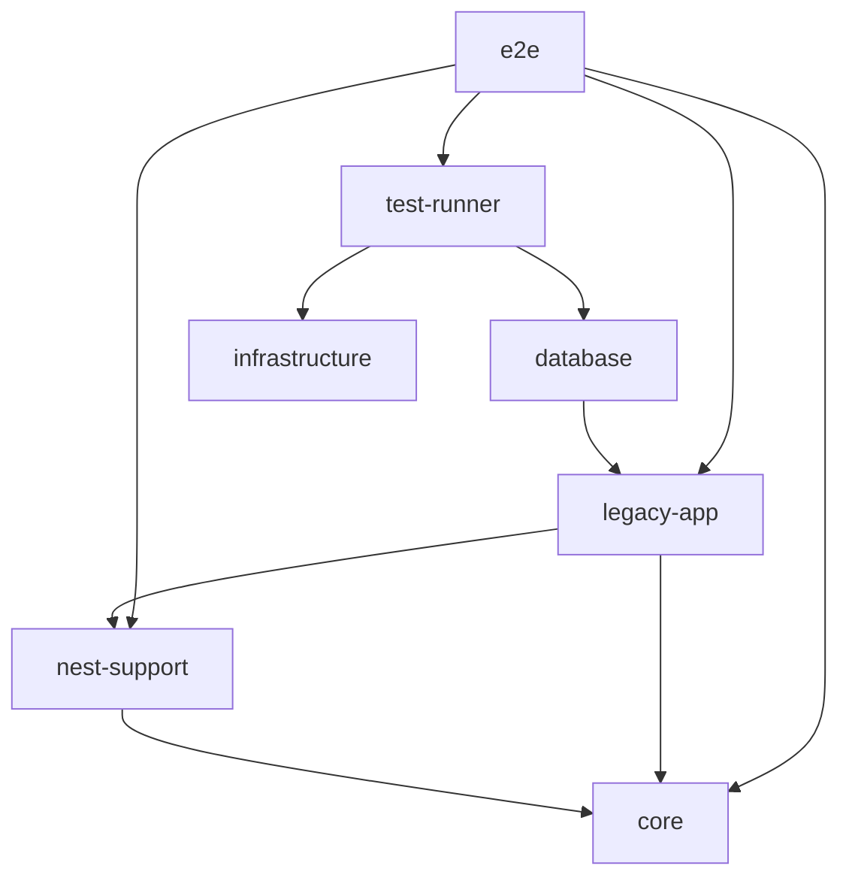

# Nx/Bun migration baseline

Issue [#17](https://github.com/danilomartinelli/vibecoding-starter-js/issues/17)
puts the existing application and regressions under Nx **23.2.1**, with Bun
**1.4.2** for installation, application execution and native tests. Nest stays on
**12.1.1**. User and Wallet still run together and share the existing transaction;
this is the runnable baseline for [ADR 0002](adr/0002-adopt-nx-with-nest-and-bun.md),
not completion of its independent services, outbox, generators or distributions.
The [User/Wallet language](../GLOSSARY.md) and ADR 0001 supersession note remain
part of that design.

## Projects and ownership

| Nx project       | Root                              | Responsibility / tests                                                                                                                                                        |
| ---------------- | --------------------------------- | ----------------------------------------------------------------------------------------------------------------------------------------------------------------------------- |
| `legacy-app`     | `src` (excluding nested projects) | Current User/Wallet application, owned entities, use cases and persistence models; domain/command tests in `src/tests` and compile-only decorator fixture in `src/type-tests` |
| `core`           | `src/packages/core`               | Plain TypeScript DDD primitives, errors, guards, serialization, decorators and technical types; generic error/command tests                                                   |
| `nest-support`   | `src/packages/nest-support`       | Nest transport DTO helpers, request context, event publication and SQL repository support; exercised through application E2E, no standalone unit suite yet                    |
| `example`        | `src/packages/example`            | Existing deep-module search-term example and its real unit test; optional starter template                                                                                    |
| `config`         | `tooling/config`                  | Shared strict ESLint, Prettier and TypeScript settings; checked as JavaScript tooling, no runtime suite                                                                       |
| `database`       | `database`                        | Existing migration history and seeds; exercised by live checks, no standalone unit suite                                                                                      |
| `infrastructure` | `docker`                          | Compose definitions and start commands; formatting applies, no TypeScript/unit target                                                                                         |
| `test-runner`    | `scripts`                         | Isolated database provisioning and real Docker lifecycle tests in `scripts/tests`                                                                                             |
| `e2e`            | `tests`                           | Seven original Gherkin cases plus four real-database regressions, with opt-in setup                                                                                           |
| `workspace`      | `.`                               | Repository formatting and architecture checks                                                                                                                                 |

`core`, `nest-support`, `example` and `config` are private Bun workspace packages.
Their package manifests export specific root entry points, with no wildcard
access to internals. Callers use imports such as `@starter/core/domain` and
`@starter/nest-support/context`. The database pool provider and environment
configuration remain application-owned. No shared project contains User/Wallet
business entities, use cases or persistence models. Package entry-point,
context-independent core and cycle rules run through dependency-cruiser; shared
technical packages may not import application implementation.



The database-to-app edge is real: migration and seed commands still read the
transitional app's connection configuration. Source imports (including type-only
imports), workspace manifests and the runner's explicit command dependencies
supply the Nx graph. Nx's built-in JavaScript analyzer is explicitly enabled;
package-manifest discovery alone would miss application imports. Shared quality
configuration is also an input of every deterministic target.

## Commands

Run commands from the repository root. `check:workspace` bootstraps guardrail
tests directly under Bun before the Nx quality commands, and `audit:changed`
runs the conditional registry check directly. `bun run nx` invokes the installed local
Nx binary using Bun, without downloading a CLI. It disables Nx's automatic
`.env` loading, preserving the existing explicit environment selection, and
turns off the daemon. Native root `eslint.config.mjs`, `prettier.config.mjs` and
`tsconfig.json` remain usable by tools and editors and import/extend the internal
configuration. Each code project has its own strict typecheck scope.

```sh
bun install --frozen-lockfile
bun run nx show projects
bun run nx show project legacy-app
bun run nx graph
bun run nx graph --file=.context/project-graph.json
bun run nx run core:test
bun run nx run legacy-app:typecheck
bun run check
bun run check:full
```

| Package command                                                          | Nx target(s)                                                                         |
| ------------------------------------------------------------------------ | ------------------------------------------------------------------------------------ |
| `lint`, `typecheck`                                                      | All applicable project `lint` / `typecheck` targets                                  |
| `test`, `test:unit`                                                      | `legacy-app:test`, `core:test`, `example:test`                                       |
| `start`, `start:dev`, `start:debug`, `start:prod`                        | `legacy-app:serve`, `watch`, `debug`, `serve-production`                             |
| `test:watch`, `test:cov`                                                 | All existing unit suites' `test-watch` / `test-coverage` targets                     |
| `test:debug`                                                             | `legacy-app:test-debug`; use `core:test-debug` or `example:test-debug` for a package |
| `test:e2e`, `test:e2e:prepared`                                          | `e2e:e2e`, `e2e:e2e-prepared`                                                        |
| `test:tooling`                                                           | `test-runner:test-live`                                                              |
| `migration:up`, `migration:down`, `migration:status`, `migration:create` | Matching `database:migration-*` target                                               |
| `seed:up`                                                                | `database:seed`                                                                      |
| `migration:*:tests`, `seed:up:tests`                                     | Corresponding database target with the `test` configuration                          |
| `docker:env`, `docker:tests`                                             | `infrastructure:up`, `infrastructure:up-test`                                        |
| `format:check`, `format`, `lint:boundaries`                              | `workspace:format-check`, `format`, `boundaries`                                     |

Arguments continue through the command chain, for example
`bun run test:e2e --test-name-pattern 'Wallet persistence failure'` and
`bun run migration:create add-user-index`. Direct Bun commands for focused
experiments remain possible; use the package commands for the quality gates.
Unit discovery has no E2E preload. Bare `bun test` runs only `src/tests`;
`test:unit` includes all three unit suites. The decorator fixture is never a
runtime test and remains in `legacy-app:typecheck`.

## Cache contract

Only lint, typecheck, unit tests, formatting checks and architecture checks are
cacheable. Inputs include the owning project's files, source dependencies, Bun
runtime version, lockfile, root manifests and shared TypeScript/ESLint/Prettier,
Bun and Nx configuration. Repository-wide checks declare repository-wide inputs;
formatting also includes documentation, root guidance and editor configuration.
The workspace guardrail tests exercise source/configuration invalidation in an
isolated cache on every invocation. Conditional dependency audits always query
the registry when applicable. Both run outside Nx; see [developer checks](developer-checks.md#workspace-and-dependency-guardrails).
These checks produce no build artifact. `.nx` is local and ignored; Nx Cloud is
not required and connections to it are disabled.

Serving, watch/debug/coverage modes, lint fixes, formatting writes, infrastructure, migrations,
seeds, database-runner lifecycle checks and both provisioned/manual live E2E
always execute (`cache: false`). Required absent service/contract/distribution
suites have no dummy targets or empty-success assertions; subsequent slices add
them to the full gate. Use `--skip-nx-cache` to force deterministic checks when
collecting fresh validation evidence.

## Tooling compatibility

Registry manifests were rechecked on September 29, 2026. Nx **23.2.1** was the
maintained stable release. Its matching `@nx/nest` still declares
`@nestjs/common` and `@nestjs/core` peers `>=10.0.0 <12.0.0`, so this baseline uses
`nx:run-commands` and repository-owned configuration. Only `nx` is installed;
there is no mismatched `@nx/*` release or Nest downgrade. Future local generators
belong to their own migration slice.

The existing compatible TypeScript 6.0.3, typescript-eslint 8.71.0, ESLint 10.11.0
and Prettier 3.9.9 are retained. Nx's vulnerable transitive `smol-toml` 1.6.1 is
overridden with stable 1.9.0; see the [dependency inventory](dependencies.md).

Sources: [Nx manifest](https://registry.npmjs.org/nx/23.2.1),
[Nx Nest peer manifest](https://registry.npmjs.org/@nx%2fnest/23.2.1),
[Nx custom commands](https://nx.dev/docs/reference/nx/executors#run-commands).
